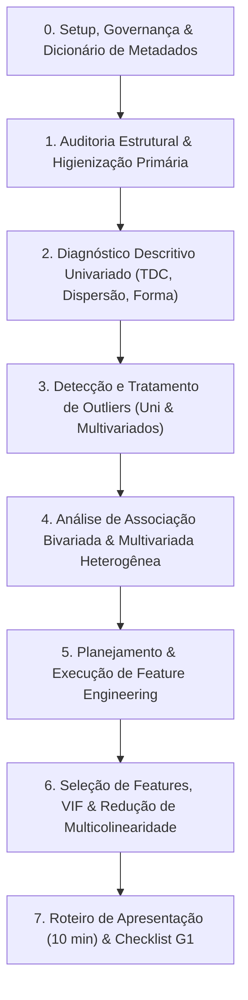

# Guia Metodológico Canônico de Análise Exploratória de Dados (AED / EDA) e Engenharia de Atributos (Feature Engineering)

**Disciplina:** Ciência dos Dados (G0544 - 2026/02) — Sistemas de Informação (AMF)  
**Docência:** Prof. Marcelo Bortoluzzi Diaz  
**Especificação Oficial:** [`content/CD/trabalho-g1.md`](file:///home/lucas/Projects/EDA/content/CD/trabalho-g1.md)  
**Harness Operacional:** [`AGENTS.md`](file:///home/lucas/Projects/EDA/AGENTS.md)  
**Semente de Reprodutibilidade:** `random_state = 42`

---

## 🧭 Sumário Executivo

Este guia estabelece o **fluxo metodológico canônico, universal e auditável** para a condução de projetos de Análise Exploratória de Dados (AED/EDA) e Engenharia de Atributos (Feature Engineering). Desenvolvido a partir da extração formal dos materiais pedagógicos, scripts estatísticos e cadernos do curso (localizados em [`./content/CD/`](file:///home/lucas/Projects/EDA/content/CD/)), este documento sintetiza:

1. **O que fazer** em cada etapa do ciclo analítico (CRISP-DM orientado a dados).
2. **Métodos estatísticos e modelos matemáticos** com fórmulas e fundamentação formal.
3. **Padrões de implementação em Python** utilizando `pandas`, `numpy`, `scipy.stats`, `statsmodels`, `seaborn`, `scikit-learn` e `skimpy`.
4. **Critérios objetivos de interpretação** de diagnósticos e decisões de engenharia de dados.
5. **Estrutura de documentação técnica** para células Markdown e roteiro da **apresentação de 10 minutos do Trabalho G1**.



---

## 📚 0. Fonte da Verdade e Ancoragem Pedagógica (`./content/CD/`)

Todo método deste guia possui ancoragem direta nos seguintes materiais de referência:

| Arquivo de Referência | Tópicos Centrais e Fórmulas Extraídas |
| :--- | :--- |
| [`trabalho-g1.md`](file:///home/lucas/Projects/EDA/content/CD/trabalho-g1.md) | Especificação oficial do Trabalho G1: AED completa + Planejamento e Execução de Feature Engineering + Apresentação de 10 min. |
| [`Estatistica.pptx`](file:///home/lucas/Projects/EDA/content/CD/Estatistica.pptx) | Axiomas de Probabilidade [Slides 14-48], Normal/Gaussiana e Z-Score [79-82], Média, Variância, Skewness, Kurtosis [70-74], Medidas de Relacionamento e OLS [86-102]. |
| [`Pos__Identificação_outlier.ipynb`](file:///home/lucas/Projects/EDA/content/CD/Pos__Identificação_outlier.ipynb) | Tukey IQR, Z-Score, MAD, Mahalanobis, Isolation Forest, DBSCAN, LOF e as 4 Estratégias de Tratamento (Trimming, Capping, Log/Yeo-Johnson, Flagging). |
| [`Titanic.ipynb`](file:///home/lucas/Projects/EDA/content/CD/Titanic.ipynb) | Função `full_summary()`, Skewness, Kurtosis, `pd.crosstab()`, Teste Qui-Quadrado ($\chi^2$), `pd.cut()` / `pd.qcut()`, e Derivação de Features. |
| [`carros.ipynb`](file:///home/lucas/Projects/EDA/content/CD/carros.ipynb) | Correlation Ratio ($\eta$), Cramér's V, Theil's U, Mutual Information ($I(X;Y)$), Regressão OLS com AIC, e VIF para Multicolinearidade. |
| [`Pinguins_exemplos.ipynb`](file:///home/lucas/Projects/EDA/content/CD/Pinguins_exemplos.ipynb) | Teste de normalidade de Shapiro-Wilk em `full_summary()`, Heatmap de correlação, formulação formal de hipóteses e prevenção de vazamento de dados. |
| [`Intro_pandas.ipynb`](file:///home/lucas/Projects/EDA/content/CD/Intro_pandas.ipynb) & [`Modulo04_aula01.ipynb`](file:///home/lucas/Projects/EDA/content/CD/Modulo04_aula01.ipynb) | *Method Chaining* (`.assign()`, `.query()`, `.pipe()`), manipulação de datas, distribuições teóricas (Binomial, Poisson) e Teorema de Bayes. |

---

## 🛠️ ETAPA 0: Setup, Governança Analítica e Dicionário de Metadados

### 1. Objetivo da Etapa
Garantir reprodutibilidade computacional irrestrita, padronizar configurações visuais acessíveis e instituir o **Dicionário Formal de Metadados** antes de qualquer manipulação numérica.

### 2. Fundamentação e Métodos
- **Taxonomia de Tipos Primitivos de Dados** ([`Estatistica.pptx`](file:///home/lucas/Projects/EDA/content/CD/Estatistica.pptx), Slides 70-72):
  - **Quantitativas Contínuas:** Medições em escala contínua com infinitos valores intermediários (ex.: valores monetários, distâncias, pesos).
  - **Quantitativas Discretas:** Contagens de valores inteiros não-negativos (ex.: quantidade de itens, número de acessos).
  - **Qualitativas Nominais:** Categorias sem ordenação intrínseca (ex.: cidade, forma de pagamento, categoria de produto).
  - **Qualitativas Ordinais:** Categorias com hierarquia lógica natural (ex.: status do pedido, nível de escolaridade, faixa de satisfação).
  - **Identificadores e Temporais:** Chaves primárias/estrangeiras e *timestamps* de eventos.

### 3. Código Padrão
```python
# ==========================================
# 0.1 Configuração de Ambiente e Bibliotecas
# ==========================================
import warnings
warnings.filterwarnings('ignore')

import numpy as np
import pandas as pd
import matplotlib.pyplot as plt
import seaborn as sns
from scipy import stats
import statsmodels.api as sm
import statsmodels.formula.api as smf
from statsmodels.stats.outliers_influence import variance_inflation_factor
from sklearn.feature_selection import mutual_info_regression, mutual_info_classif, SelectKBest
from sklearn.preprocessing import StandardScaler, RobustScaler, MinMaxScaler, PowerTransformer, OneHotEncoder
from sklearn.ensemble import IsolationForest
from sklearn.cluster import DBSCAN
from sklearn.model_selection import train_test_split

# Reprodutibilidade estrita
SEED = 42
np.random.seed(SEED)

# Estilo gráfico corporativo limpo
plt.style.use('seaborn-v0_8-whitegrid')
plt.rcParams['figure.figsize'] = (10, 5)
plt.rcParams['font.size'] = 11
plt.rcParams['axes.titlesize'] = 14
plt.rcParams['axes.titleweight'] = 'bold'
plt.rcParams['figure.titlesize'] = 16

# ==========================================
# 0.2 Carregamento do Dado Bruto (Imutável)
# ==========================================
caminho_dados = 'dataset-kalimentos-vendas.csv' # ou arquivo do projeto
df_raw = pd.read_csv(caminho_dados)
df = df_raw.copy() # O dado bruto nunca é sobrescrito

print(f"Dimensões do conjunto bruto: {df.shape[0]} registros por {df.shape[1]} atributos.")
```

### 4. Dicionário de Metadados
Todo projeto deve documentar explicitamente a tabela de metadados:

```markdown
| Nome da Coluna | Tipo Primitivo | Tipo Semântico | Descrição de Negócio | Unidade de Medida | Regra de Domínio / Restrição |
| :--- | :--- | :--- | :--- | :--- | :--- |
| `id_pedido` | `int64` | Identificador | Chave primária única da transação | N/A | Único, não-nulo |
| `data_pedido` | `object` $\to$ `datetime` | Temporal | Timestamp de efetivação da venda | Data/Hora | $\le$ Data atual |
| `valor_total` | `float64` | Quantitativa Contínua | Valor líquido final faturado | Reais (R$) | Valor $\ge 0,00$ |
| `categoria` | `object` $\to$ `category` | Qualitativa Nominal | Grupo mercadológico do item | N/A | Valores cadastrados válidos |
| `status` | `object` $\to$ `category` | Qualitativa Ordinal | Etapa do ciclo de atendimento | N/A | [Pendente, Aprovado, Entregue] |
```

---

## 🧹 ETAPA 1: Auditoria Estrutural e Higienização Primária (Data Audit & Cleaning)

### 1. Objetivo da Etapa
Inspecionar a consistência estrutural dos registros, padronizar identificadores de colunas, auditar dados ausentes (*Missing Values*), remover duplicatas espúrias e verificar **invariantes de integridade do negócio**.

### 2. Fundamentação e Métodos
- **Padronização Sintática:** Normalização de strings para estilo `snake_case`, eliminando caracteres especiais, acentuação e espaços em branco que quebram queries ou encadeamentos de métodos.
- **Invariantes de Domínio e Integridade Contábil:**
  $$\text{Valor Total} \equiv \text{Subtotal} - \text{Descontos} + \text{Frete/Acréscimos}$$
  Divergências matemáticas superiores a R$ 0,01 decorrentes de truncamento de ponto flutuante devem ser isoladas e auditadas antes do processamento.
- **Auditoria de Missing Data (Tipologia de Rubin):**
  - **MCAR (Missing Completely at Random):** A falta independe de qualquer variável.
  - **MAR (Missing at Random):** A falta depende de variáveis observadas, mas não do próprio valor ausente.
  - **MNAR (Missing Not at Random):** A própria omissão guarda relação causal com a variável (ex.: clientes de alta renda que se recusam a declarar salário).

### 3. Código Padrão
```python
# ==========================================
# 1.1 Padronização de Nomes de Colunas
# ==========================================
import re
import unicodedata

def padronizar_colunas(df_in):
    def normalizar(col):
        col = unicodedata.normalize('NFKD', col).encode('ASCII', 'ignore').decode('utf-8')
        col = re.sub(r'[\s\.\-]+', '_', col.strip())
        col = re.sub(r'[^\w_]', '', col)
        return col.lower()
    
    return df_in.rename(columns={c: normalizar(c) for c in df_in.columns})

df = padronizar_colunas(df)

# ==========================================
# 1.2 Coerção Segura de Tipos de Dados
# ==========================================
# Identificar colunas temporais e numéricas
colunas_datas = [c for c in df.columns if any(k in c for k in ['data', 'date', 'hora', 'tempo'])]
for c in colunas_datas:
    df[c] = pd.to_datetime(df[c], errors='coerce')

# ==========================================
# 1.3 Auditoria de Nulos e Duplicatas
# ==========================================
def relatorio_higienizacao(df_in):
    total_linhas = len(df_in)
    nulos = df_in.isnull().sum()
    pct_nulos = (nulos / total_linhas) * 100
    duplicatas = df_in.duplicated().sum()
    
    relatorio = pd.DataFrame({
        'Nulos_Absolutos': nulos,
        'Nulos_Percentual (%)': pct_nulos.round(2),
        'Tipo_Dado': df_in.dtypes
    })
    
    print(f"==> Linhas Duplicadas Integrais: {duplicatas} ({duplicatas/total_linhas*100:.2f}%)")
    return relatorio[relatorio['Nulos_Absolutos'] > 0].sort_values(by='Nulos_Percentual (%)', ascending=False)

relatorio_nulos = relatorio_higienizacao(df)
display(relatorio_nulos)

# ==========================================
# 1.4 Verificação de Invariantes Financeiras
# ==========================================
# Exemplo de regra financeira: subtotal - desconto = total
if {'pedido_subtotal', 'pedido_valor_desconto', 'pedido_valor_total'}.issubset(df.columns):
    divergencias = (df['pedido_subtotal'] - df['pedido_valor_desconto'] - df['pedido_valor_total']).abs()
    falhas_invariante = df[divergencias > 0.01]
    print(f"==> Divergências da Invariante Financeira: {len(falhas_invariante)} transações.")
```

### 4. Critério de Decisão de Negócio
- Se uma coluna apresentar $> 50\%$ de nulos e não contiver informação MNAR de alto valor preditivo: avaliar exclusão fundamentada.
- Se uma coluna contiver nulos entre $1\%$ e $20\%$: planejar imputação estatística (Etapa 5) associada a uma flag binária indicadora de ausência.
- Duplicatas exatas de registros transacionais devem ser eliminadas imediatamente via `.drop_duplicates()`.

---

## 📊 ETAPA 2: Diagnóstico Estatístico Descritivo Univariado (TDC, Dispersão, Forma e Normalidade)

### 1. Objetivo da Etapa
Avaliar a estrutura distributiva de cada atributo individualmente. Medir Tendência Central (TDC), dispersão, achatamento e assimetria, diagnosticando visualmente e formalmente desvios da normalidade.

### 2. Fundamentação e Métodos
Ancoragem direta em [`Estatistica.pptx`](file:///home/lucas/Projects/EDA/content/CD/Estatistica.pptx) [Slides 70-85], [`Titanic.ipynb`](file:///home/lucas/Projects/EDA/content/CD/Titanic.ipynb) [Célula 19] e [`Pinguins_exemplos.ipynb`](file:///home/lucas/Projects/EDA/content/CD/Pinguins_exemplos.ipynb) [Célula 4]:

1. **Medidas de Tendência Central (TDC):**
   - Média Amostral: $\bar{x} = \frac{1}{n}\sum_{i=1}^n x_i$
   - Mediana ($Q_2$): $50^{\circ}$ percentil, medida robusta insensível a valores extremos.
   - Moda: valor ou intervalo de maior frequência modal.
2. **Medidas de Dispersão e Escala:**
   - Variância Amostral: $s^2 = \frac{1}{n-1} \sum_{i=1}^n (x_i - \bar{x})^2$
   - Desvio Padrão Amostral: $s = \sqrt{s^2}$
   - Intervalo Interquartil: $\text{IQR} = Q_3 - Q_1 = P_{75} - P_{25}$
   - Coeficiente de Variação de Pearson: $\text{CV} = \frac{s}{\bar{x}} \times 100\%$ ($\text{CV} > 30\%$ indica alta heterogeneidade amostral).
3. **Medidas de Forma:**
   - **Assimetria (*Skewness* de Fisher-Pearson):**
     $$g_1 = \frac{\frac{1}{n}\sum_{i=1}^n (x_i - \bar{x})^3}{\left[\frac{1}{n}\sum_{i=1}^n (x_i - \bar{x})^2\right]^{3/2}}$$
     - $g_1 \approx 0$: Distribuição Simétrica.
     - $g_1 > +1.0$: Assimetria Positiva Severa (cauda longa à direita, média $>$ mediana).
     - $g_1 < -1.0$: Assimetria Negativa Severa (cauda longa à esquerda, média $<$ mediana).
   - **Curtose de Excesso (*Kurtosis* de Fisher):**
     $$g_2 = \frac{\frac{1}{n}\sum_{i=1}^n (x_i - \bar{x})^4}{\left[\frac{1}{n}\sum_{i=1}^n (x_i - \bar{x})^2\right]^2} - 3$$
     - $g_2 = 0$: Mesocúrtica (comportamento análogo à Normal Gaussiana).
     - $g_2 > 0$ (especialmente $g_2 > 1$ ou $Kurt > 4$ no referencial de aula): Leptocúrtica (caudas pesadas, alta densidade de valores atípicos nos extremos).
     - $g_2 < 0$: Platicúrtica (distribuição achatada, caudas leves).
4. **Teste de Normalidade de Shapiro-Wilk:**
   $$W = \frac{\left(\sum_{i=1}^n a_i x_{(i)}\right)^2}{\sum_{i=1}^n (x_i - \bar{x})^2}$$
   - Hipótese Nula ($H_0$): A amostra provém de uma população normalmente distribuída.
   - Decisão: Se $p\text{-valor} < 0.05$, rejeita-se $H_0$ ao nível de significância de 5%.

### 3. Código Padrão: Função Canônica `full_summary()`
```python
from scipy.stats import skew, kurtosis, shapiro

def full_summary(df_in):
    """
    Função de diagnóstico univariado oficial das aulas de Ciência dos Dados (AMF).
    Calcula parâmetros descritivos, IQR, CV, Skewness, Kurtosis e p-valor de Shapiro-Wilk.
    """
    colunas_numericas = df_in.select_dtypes(include=['number']).columns
    
    # Base clássica do describe
    resumo = df_in[colunas_numericas].describe().T
    
    # Inclusão das métricas estatísticas formais
    resumo['IQR'] = df_in[colunas_numericas].apply(lambda x: x.quantile(0.75) - x.quantile(0.25))
    resumo['CV (%)'] = (resumo['std'] / resumo['mean'] * 100).round(2)
    resumo['skewness'] = df_in[colunas_numericas].apply(lambda x: skew(x.dropna()))
    resumo['kurtosis'] = df_in[colunas_numericas].apply(lambda x: kurtosis(x.dropna()))
    
    # Teste de Shapiro-Wilk (para amostras até 5000 registros; se n > 5000, amostra 5000 observações)
    def calc_shapiro(x):
        dados_limpos = x.dropna()
        if len(dados_limpos) < 3:
            return np.nan
        amostra = dados_limpos.sample(n=min(len(dados_limpos), 5000), random_state=SEED)
        return shapiro(amostra)[1]
    
    resumo['shapiro_p_value'] = df_in[colunas_numericas].apply(calc_shapiro)
    resumo['is_normal'] = resumo['shapiro_p_value'] > 0.05
    
    return resumo.round(4)

df_diagnostico_univariado = full_summary(df)
display(df_diagnostico_univariado)
```

### 4. Visualização Gráfica Univariada
```python
def plotar_diagnostico_numerico(df_in, coluna):
    fig, axes = plt.subplots(1, 2, figsize=(14, 4))
    
    # 1. Histograma com KDE e linhas de TDC
    sns.histplot(data=df_in, x=coluna, kde=True, ax=axes[0], color='steelblue', edgecolor='black')
    media = df_in[coluna].mean()
    mediana = df_in[coluna].median()
    axes[0].axvline(media, color='red', linestyle='--', linewidth=2, label=f'Média ({media:.2f})')
    axes[0].axvline(mediana, color='green', linestyle='-', linewidth=2, label=f'Mediana ({mediana:.2f})')
    axes[0].set_title(f'Histograma & KDE: {coluna}')
    axes[0].legend()
    
    # 2. Boxplot com identificação de quartis
    sns.boxplot(data=df_in, x=coluna, ax=axes[1], color='lightblue', flierprops=dict(marker='o', color='crimson', alpha=0.5))
    axes[1].set_title(f'Boxplot: {coluna}')
    
    plt.tight_layout()
    plt.show()

# Para cada variável contínua relevante:
# plotar_diagnostico_numerico(df, 'coluna_chave')
```

---

## 🎯 ETAPA 3: Detecção e Tratamento Formal de Outliers (Univariados e Multivariados)

### 1. Objetivo da Etapa
Identificar pontos discrepantes que distorcem estimadores pontuais e violam suposições paramétricas. Executar a **Taxonomia Formal de 4 Estratégias de Tratamento** ancorada no referencial pedagógico.

### 2. Fundamentação e Métodos
Ancoragem em [`Pos__Identificação_outlier.ipynb`](file:///home/lucas/Projects/EDA/content/CD/Pos__Identificação_outlier.ipynb) [Células 5-24, 45-50] e [`Estatistica.pptx`](file:///home/lucas/Projects/EDA/content/CD/Estatistica.pptx) [Slides 80-82]:

#### A. Métodos Univariados
1. **Critério de Tukey (Intervalo Interquartil - IQR):**
   - Não depende de premissa de normalidade.
   $$\text{IQR} = Q_3 - Q_1$$
   $$\text{Limite Inferior} = Q_1 - c \times \text{IQR}$$
   $$\text{Limite Superior} = Q_3 + c \times \text{IQR}$$
   - $c = 1.5$: Outlier moderado (fronteira do Boxplot).
   - $c = 3.0$: Outlier severo / extremo.
2. **Z-Score Paramétrico:**
   - Válido exclusivamente para distribuições aproximadamente Gaussianas.
   $$Z_i = \frac{x_i - \mu}{\sigma}$$
   - Regra empírica das 3 Sigmas: Observações com $|Z_i| > 3.0$ estão fora de 99,73% da densidade teórica.
3. **Z-Score Robusto via MAD (Median Absolute Deviation):**
   - Imune à contaminação da média e do desvio padrão por outliers extremos.
   $$\text{MAD} = \text{mediana}(|x_i - \text{mediana}(X)|)$$
   $$\text{Limites} = \text{mediana} \pm 3 \times \text{MAD}$$

#### B. Métodos Multivariados
1. **Distância de Mahalanobis:**
   - Mede o afastamento multidimensional de um vetor $\vec{x}$ em relação ao baricentro $\vec{\mu}$, compensando a matriz de covariância $\Sigma$:
   $$D_M(\vec{x}) = \sqrt{(\vec{x} - \vec{\mu})^T \Sigma^{-1} (\vec{x} - \vec{\mu})}$$
   - Threshold de corte: Distribuição Qui-Quadrado com $p$ graus de liberdade no percentil 99%: $\chi^2_{p, 0.99}$.
2. **Isolation Forest (Floresta de Isolação):**
   - Algoritmo não-paramétrico baseado no princípio de que anomalias exigem menor profundidade de árvore $h(x)$ para serem isoladas em partições ortogonais aleatórias:
   $$s(x, n) = 2^{-\frac{\mathbb{E}(h(x))}{c(n)}}$$
   - Parâmetros: `contamination` (estimativa prévia de ruído), `n_estimators=500`, `random_state=42`.
3. **DBSCAN (Clustering Baseado em Densidade):**
   - Dados previamente padronizados (`StandardScaler`). Detecta núcleos densos e rotula pontos em zonas de baixa densidade com o índice $-1$ (ruído). Parâmetros cruciais: `eps` (raio euclidiano) e `min_samples`.

#### C. As 4 Estratégias de Tratamento Formal
Conforme definido em [`Pos__Identificação_outlier.ipynb`](file:///home/lucas/Projects/EDA/content/CD/Pos__Identificação_outlier.ipynb) [Célula 45]:
- **Estratégia 1: Remoção (Trimming):** Exclusão estrita apenas quando comprovada a ocorrência de erro de sistema/digitação ou registro fisicamente inviável (ex.: idade de 500 anos, valor negativo impossível).
- **Estratégia 2: Limitação (Capping / Winsorization):** Substituição do valor extremo pelo limiar estipulado ($L_{sup}$ ou $L_{inf}$). Preserva o registro da transação nas demais colunas e reduz a distorção da variância para algoritmos paramétricos (Regressão Linear, OLS, KNN).
- **Estratégia 3: Transformação Não-Linear (Log1p ou Yeo-Johnson):** Aplicação de função compressora côncava ($\ln(1+x)$) para aproximar a distribuição de uma Gaussiana sem perder a ordenação dos dados.
- **Estratégia 4: Manutenção com Flag Indicador (Auditoria / Detecção):** Manter o dado bruto inalterado e criar o atributo binário `is_outlier = 1`. Obrigatório para modelos imunes a escala (árvores de decisão / XGBoost) e projetos de detecção de fraudes/anomalias.

### 3. Código Padrão
```python
def calcular_limites_tukey(df_in, coluna, multiplicador=1.5):
    q1 = df_in[coluna].quantile(0.25)
    q3 = df_in[coluna].quantile(0.75)
    iqr = q3 - q1
    lim_inf = q1 - multiplicador * iqr
    lim_sup = q3 + multiplicador * iqr
    return lim_inf, lim_sup

def winsorizar_coluna(df_in, coluna, lim_inf, lim_sup):
    """Aplica Capping / Winsorization preservando a série."""
    return df_in[coluna].clip(lower=lim_inf, upper=lim_sup)

def isolar_outliers_multivariados_iforest(df_in, colunas_numericas, contaminacao=0.02):
    """Detecção Multivariada via Isolation Forest."""
    X = df_in[colunas_numericas].dropna()
    modelo_if = IsolationForest(contamination=contaminacao, n_estimators=500, random_state=SEED)
    pred = modelo_if.fit_predict(X)
    scores = modelo_if.decision_function(X)
    
    df_resultado = df_in.copy()
    df_resultado.loc[X.index, 'outlier_if'] = np.where(pred == -1, 1, 0)
    df_resultado.loc[X.index, 'score_if'] = scores
    return df_resultado
```

---

## 🔗 ETAPA 4: Análise de Associação Bivariada e Multivariada Heterogênea

### 1. Objetivo da Etapa
Avaliar a intensidade e o sentido dos relacionamentos entre todos os pares de atributos, selecionando a métrica estatisticamente compatível com o par de variáveis (Numérica $\times$ Numérica, Numérica $\times$ Categórica, Categórica $\times$ Categórica) e prevenindo conclusões espúrias decorrentes do **Paradoxo de Simpson**.

### 2. Fundamentação e Métodos
Ancoragem formal em [`carros.ipynb`](file:///home/lucas/Projects/EDA/content/CD/carros.ipynb) [Células 12-30] e [`Titanic.ipynb`](file:///home/lucas/Projects/EDA/content/CD/Titanic.ipynb) [Células 54-60]:

#### A. Numérica $\times$ Numérica
1. **Coeficiente de Correlação Linear de Pearson ($r$):**
   $$r = \frac{\sum_{i=1}^n (x_i - \bar{x})(y_i - \bar{y})}{\sqrt{\sum_{i=1}^n (x_i - \bar{x})^2 \sum_{i=1}^n (y_i - \bar{y})^2}}$$
   - Mede dependência linear. Sensível a outliers e pressupõe normalidade bivariada.
2. **Coeficiente de Correlação de Postos de Spearman ($\rho$):**
   $$\rho = 1 - \frac{6 \sum d_i^2}{n(n^2 - 1)}$$
   - Mede monotonicidade através do ranking dos postos. Não-paramétrico e robusto a assimetrias.

#### B. Numérica $\times$ Categórica
**Correlation Ratio ($\eta$ – Eta):**
- Medida oficial de associação entre uma variável numérica contínua ($Y$) e uma variável categórica ($X$) com $k$ grupos ([`carros.ipynb`](file:///home/lucas/Projects/EDA/content/CD/carros.ipynb), Célula 21):
$$\eta^2 = \frac{SS_{\text{entre}}}{SS_{\text{total}}} = \frac{\sum_{j=1}^k n_j (\bar{y}_j - \bar{y})^2}{\sum_{i=1}^n (y_i - \bar{y})^2}$$
$$\eta = \sqrt{\frac{SS_{\text{entre}}}{SS_{\text{total}}}}$$
- **Interpretação:** $\eta \in [0, 1]$. Representa a proporção da variabilidade total de $Y$ que é explicada pela dispersão entre os grupos de $X$ (idêntico ao $R^2$ de uma ANOVA univariada).

#### C. Categórica $\times$ Categórica
1. **Tabelas de Contingência e Teste Qui-Quadrado ($\chi^2$):**
   $$\chi^2 = \sum_{i=1}^r \sum_{j=1}^k \frac{(O_{ij} - E_{ij})^2}{E_{ij}}, \quad E_{ij} = \frac{R_i \cdot C_j}{n}$$
   - Se $p\text{-valor} < 0.05$, rejeita-se a hipótese nula de independência estatística.
2. **V de Cramér ($V$):**
   $$V = \sqrt{\frac{\chi^2}{n \cdot \min(r - 1, k - 1)}}$$
   - Onde $r$ é o número de linhas e $k$ é o número de colunas. $V \in [0, 1]$.
   - $V < 0.10$: Associação fraca / desprezível.
   - $0.10 \le V < 0.30$: Associação moderada.
   - $V \ge 0.30$: Associação substancial.
3. **Theil’s U (Coeficiente de Incerteza Assimétrico):**
   $$U(X|Y) = \frac{H(X) - H(X|Y)}{H(X)}$$
   - Mede quantos bits de incerteza (entropia de Shannon $H(X)$) são eliminados a respeito de $X$ ao conhecermos o estado de $Y$.

#### D. Associação Geral Não-Linear (Qualquer Par de Tipos)
**Informação Mútua (Mutual Information - $I(X;Y)$):**
$$I(X;Y) = H(X) + H(Y) - H(X,Y)$$
$$H(X) = -\sum_{i=1}^n p(x_i) \log_2 p(x_i)$$
- Captura relações lineares, senoidais, exponenciais e descontinuidades em escada sem impor qualquer forma funcional prévia.

#### E. Paradoxo de Simpson
Ocorre quando uma tendência agregada verificada na população total se inverte ou desaparece quando os dados são desagregados em subgrupos relevantes. Deve-se inspecionar relações controlando por variáveis categóricas estruturantes (ex.: região, filial, tipo de canal).

### 3. Código Padrão: Métricas Heterogêneas
```python
def correlation_ratio(categorias, valores):
    """Calcula o Correlation Ratio (Eta) entre categórica e numérica."""
    categorias = pd.Series(categorias)
    valores = pd.Series(valores)
    
    media_geral = valores.mean()
    sst = np.sum((valores - media_geral) ** 2)
    
    medias_grupos = valores.groupby(categorias).mean()
    tamanhos_grupos = valores.groupby(categorias).count()
    
    ssb = np.sum(tamanhos_grupos * (medias_grupos - media_geral) ** 2)
    
    if sst == 0:
        return 0.0
    return np.sqrt(ssb / sst)

def cramers_v(x, y):
    """Calcula o V de Cramér entre duas variáveis categóricas."""
    tabela = pd.crosstab(x, y)
    chi2_val, p, dof, _ = stats.chi2_contingency(tabela)
    n = tabela.sum().sum()
    r, k = tabela.shape
    min_dim = min(r - 1, k - 1)
    if min_dim == 0 or n == 0:
        return 0.0
    return np.sqrt(chi2_val / (n * min_dim))
```

---

## ⚙️ ETAPA 5: Planejamento e Execução de Feature Engineering

### 1. Objetivo da Etapa
Documentar formalmente e executar a transformação matemática, codificação, escalonamento e enriquecimento do conjunto de atributos, atendendo estritamente à **regra de não-vazamento de dados (*No Data Leakage*)**.

### 2. Fundamentação e Métodos
Ancoragem em [`trabalho-g1.md`](file:///home/lucas/Projects/EDA/content/CD/trabalho-g1.md) (Requisito 2), [`Titanic.ipynb`](file:///home/lucas/Projects/EDA/content/CD/Titanic.ipynb) [Células 62-68] e [`carros.ipynb`](file:///home/lucas/Projects/EDA/content/CD/carros.ipynb):

1. **Protocolo Anti-Vazamento (*Data Leakage Prevention*):**
   - Toda estimativa paramétrica (média para imputação, limites de quantis para winsorização, variância para `StandardScaler`, categorias vistas para `OneHotEncoder`) deve ser calculada **exclusivamente na partição de Treino** (`.fit()`). A partição de Teste recebe apenas a transformação (`.transform()`).
2. **Tratamento de Missing Values:**
   - Variáveis Simétricas: Imputação pela Média.
   - Variáveis Assimétricas ($|Skew| > 1.0$): Imputação pela Mediana.
   - Variáveis Qualitativas: Categoria explícita `'Desconhecido'` ou Moda.
   - Adição do Indicador de Ausência: `df['col_was_missing'] = df['col'].isnull().astype(int)`.
3. **Codificação Categórica (Encoding):**
   - **One-Hot Encoding:** Para nominais com baixa cardinalidade ($k \le 10$), aplicando `drop_first=True` para evitar colinearidade estrita (*Dummy Variable Trap*).
   - **Agrupamento de Cauda Longa:** Categorias raras ($< 2\%$ de representatividade) devem ser agrupadas no rótulo `'Outros'` antes do encoding (conforme praticado no tratamento de títulos em [`Titanic.ipynb`](file:///home/lucas/Projects/EDA/content/CD/Titanic.ipynb)).
   - **Ordinal Encoding:** Para categorias com ordem lógica verificada.
4. **Discretização / Binning:**
   - Intervalos de mesma frequência: `pd.qcut(df['col'], q=k)`.
   - Intervalos de mesma amplitude / negócio: `pd.cut(df['col'], bins=faixas)`.
5. **Escalonamento Numérico:**
   - **StandardScaler:** Centraliza na média 0 com variância unitária: $Z = \frac{x - \mu}{\sigma}$ (adequado para regressões OLS, KNN e redes).
   - **RobustScaler:** Centraliza na mediana e escalona pelo IQR: $X_{\text{rob}} = \frac{x - Q_2}{IQR}$ (ideal na presença de caudas pesadas).
   - **MinMaxScaler:** Limita o intervalo em $[0, 1]$: $X_{\text{norm}} = \frac{x - x_{\min}}{x_{\max} - x_{\min}}$.
   - **PowerTransformer (Yeo-Johnson):** Estabiliza a variância e aproxima a normalidade para números positivos e negativos.
6. **Criação de Variáveis Derivadas (*Feature Derivation*):**
   - *Ratios de Negócio:* Percentual de Desconto Concedido ($\frac{\text{Desconto}}{\text{Subtotal}}$), Ticket Médio por Item ($\frac{\text{Valor Total}}{\text{Quantidade}}$).
   - *Decomposição Temporal:* Dia da semana (`dt.day_name()`), hora do dia, indicador booleano de final de semana (`dt.weekday >= 5`).
   - *Engenharia de Texto / Regex:* Extração de padrões relevantes via expressões regulares (`df['col'].str.extract(r'regex')`).

### 3. Código Padrão de Engenharia
```python
# ==========================================
# 5.1 Separação Treino / Teste (Anti-Leakage)
# ==========================================
# Supondo coluna alvo definida (ex: 'pedido_valor_total' ou target de classificação)
X = df.drop(columns=['coluna_alvo']) if 'coluna_alvo' in df.columns else df.copy()
y = df['coluna_alvo'] if 'coluna_alvo' in df.columns else None

X_train, X_test = train_test_split(X, test_size=0.20, random_state=SEED)
print(f"Treino: {X_train.shape} | Teste: {X_test.shape}")

# ==========================================
# 5.2 Derivação de Features (Regras Puras)
# ==========================================
def derivar_atributos(df_in):
    df_out = df_in.copy()
    
    # 1. Temporal
    if 'data_pedido' in df_out.columns:
        df_out['pedido_ano'] = df_out['data_pedido'].dt.year
        df_out['pedido_mes'] = df_out['data_pedido'].dt.month
        df_out['pedido_dia_semana'] = df_out['data_pedido'].dt.day_name()
        df_out['pedido_is_fim_de_semana'] = df_out['data_pedido'].dt.weekday.isin([5, 6]).astype(int)
    
    # 2. Ratios Financeiros
    if {'pedido_subtotal', 'pedido_valor_desconto'}.issubset(df_out.columns):
        df_out['ratio_desconto'] = (df_out['pedido_valor_desconto'] / df_out['pedido_subtotal']).replace([np.inf, -np.inf], 0).fillna(0)
    
    return df_out

X_train_eng = derivar_atributos(X_train)
X_test_eng = derivar_atributos(X_test)
```

---

## 🔬 ETAPA 6: Seleção de Features, Diagnóstico de Multicolinearidade e Exportação Auditável

### 1. Objetivo da Etapa
Prevenir o sobreajuste (*overfitting*), diagnosticar redundâncias colineares que inflam a variância dos coeficientes e selecionar o subconjunto parcimonioso de atributos através de critérios de teoria da informação e econometria.

### 2. Fundamentação e Métodos
Ancoragem em [`carros.ipynb`](file:///home/lucas/Projects/EDA/content/CD/carros.ipynb) [Células 30-33] e [`Pinguins_exemplos.ipynb`](file:///home/lucas/Projects/EDA/content/CD/Pinguins_exemplos.ipynb) [Células 15, 29]:

1. **Fator de Inflação da Variância (VIF - Variance Inflation Factor):**
   - Mede o quanto a variância de um coeficiente estimado é inflacionada pela presença de colinearidade com os demais regressores:
   $$\text{VIF}_j = \frac{1}{1 - R_j^2}$$
   - Onde $R_j^2$ é o coeficiente de determinação da regressão auxiliar da feature $X_j$ contra todas as outras $X_{-j}$.
   - **Critério de Decisão:**
     - $\text{VIF} < 5$: Multicolinearidade baixa (aceitável).
     - $5 \le \text{VIF} < 10$: Multicolinearidade moderada (exige atenção e monitoramento).
     - $\text{VIF} \ge 10$: Multicolinearidade severa (eliminar ou combinar o atributo redundante).
2. **Seleção Univariada por Informação Mútua:**
   - Ranqueamento via `SelectKBest` utilizando `mutual_info_regression` ou `mutual_info_classif` para triar os $k$ preditores mais informativos.
3. **Seleção Paramétrica por Minimização de AIC (Critério de Akaike):**
   - Ajuste de modelos lineares OLS via `statsmodels.formula.api`:
   $$\text{AIC} = 2k - 2\ln(\hat{L})$$
   - Penaliza a complexidade do modelo ($k$ regressores) em favor da Navalha de Occam ([`Estatistica.pptx`](file:///home/lucas/Projects/EDA/content/CD/Estatistica.pptx), Slide 102).

### 3. Código Padrão de VIF e Seleção
```python
def calcular_vif(df_in, colunas_numericas):
    """Calcula o VIF para diagnóstico de multicolinearidade."""
    X_matriz = df_in[colunas_numericas].dropna()
    # Adicionar constante para o cálculo correto da regressão auxiliar
    X_matriz_const = sm.add_constant(X_matriz)
    
    vif_df = pd.DataFrame()
    vif_df["Feature"] = X_matriz_const.columns
    vif_df["VIF"] = [variance_inflation_factor(X_matriz_const.values, i) for i in range(X_matriz_const.shape[1])]
    
    # Exclui a constante da exibição de tomada de decisão
    return vif_df[vif_df["Feature"] != 'const'].sort_values(by='VIF', ascending=False).reset_index(drop=True)

# Execução:
# vif_resultado = calcular_vif(X_train_eng, lista_features_numericas)
# display(vif_resultado)
```

---

## 🎤 ETAPA 7: Roteiro da Apresentação Executiva em Sala de Aula (10 Minutos)

Conforme estipulado no documento oficial [`content/CD/trabalho-g1.md`](file:///home/lucas/Projects/EDA/content/CD/trabalho-g1.md), o aluno dispõe de **10 minutos** para apresentar presencialmente o diagnóstico dos dados, as decisões tomadas e os aprendizados de engenharia. O tempo deve ser dividido rigidamente no seguinte formato:

```markdown
### ⏱️ Cronograma Minuto a Minuto da Apresentação (10 min)

| Intervalo | Bloco | Conteúdo Obrigatório a Expor | Recursos Visuais Recomendados |
| :--- | :--- | :--- | :--- |
| **00:00 - 02:00** | **1. Problema de Negócio & Metadados** | Contexto da empresa/domínio, objetivo analítico (qual valor queremos gerar?), dimensões brutas ($n \times p$) e classificação das variáveis. | Tabela do Dicionário de Metadados e KPI principal de negócio. |
| **02:00 - 04:00** | **2. Diagnóstico Univariado & Desafios** | Apresentação da tabela `full_summary()`, destaque das variáveis com assimetria severa ($|Skew| > 1.0$), alta dispersão ($CV > 50\%$) e não-normalidade (Shapiro-Wilk). | Histogramas com KDE sobrepostos por Média/Mediana. |
| **04:00 - 06:00** | **3. Outliers & Decisão de Tratamento** | Demonstrar os outliers encontrados (Tukey IQR e multivariados IF/DBSCAN). Justificar a decisão entre Trimming, Winsorization, Log ou Flagging. | Boxplots antes e depois do Capping / Gráficos de dispersão multivariados. |
| **06:00 - 08:00** | **4. Associações & Engenharia de Features** | Exibir as associações heterogêneas (Pearson, Correlation Ratio $\eta$, Cramér's V). Apresentar as novas variáveis derivadas (ratios, temporais) e codificação. | Heatmap de associação heterogênea e gráficos de barras empilhadas com $\chi^2$. |
| **08:00 - 10:00** | **5. Multicolinearidade & Conclusão** | Diagnóstico de VIF, seleção final de atributos, garantia de No Data Leakage e resumo do dataset final pronto para modelagem preditiva. | Tabela de VIF antes e depois do descarte / Resumo executivo de impacto. |
```

---

## 📝 Modelo Canônico de Célula Markdown de Insight Pós-Visualização

O trabalho exige formalmente que **logo após cada gráfico ou tabela estatística** seja inserida uma célula Markdown estruturada. O modelo canônico a seguir deve ser replicado sistematicamente:

```markdown
> 🔍 **Insight Técnico e Diagnóstico de Engenharia**
>
> - **Padrão Observado:** A variável `pedido_valor_total` exibe distribuição fortemente assimétrica à direita ($Skew = +2.45$, Média de R$ 420,00 vs Mediana de R$ 185,00) e curtose leptocúrtica ($Kurt = 8.12$), indicando caudas longas com concentração acentuada de transações de alto valor.
> - **Validação Estatística:** O teste de Shapiro-Wilk resultou em $p\text{-valor} = 0.00001 < 0.05$, rejeitando categoricamente a hipótese de normalidade gaussiana.
> - **Identificação de Anomalias:** O critério de Tukey ($1.5 \times IQR$) detectou 42 transações ($2.8\%$ da base) acima de R$ 1.150,00. Uma inspeção revelou que tratam-se de compras legítimas corporativas (B2B), descartando erro de digitação.
> - **Decisão de Engenharia (Feature Engineering):**
>   1. Rejeitou-se o *Trimming* (descarte) para não subdimensionar o faturamento corporativo.
>   2. Aplicou-se *Capping/Winsorization* no percentil 99 para atenuar o impacto da variância em modelos lineares.
>   3. Criou-se a variável derivada `pedido_valor_total_log = log1p(valor)` para estabilizar a dispersão.
>   4. Criou-se a flag indicadora `is_pedido_b2b_outlier = 1` para permitir que modelos baseados em árvores capturem o comportamento desse segmento.
```

---

## ✅ Checklist Geral de Auditoria e Conformidade para o Trabalho G1

Antes de submeter o caderno ao Google Colab e iniciar a apresentação presencial, certifique-se de validar cada um dos itens abaixo:

- [ ] **Ambiente e Governança:** O notebook é totalmente executável do início ao fim no Google Colab, com sementes fixadas (`random_state=42`) e sem warnings suprimidos inadvertidamente.
- [ ] **Dicionário de Dados:** Todas as colunas do dataset possuem definição conceitual, tipo semântico e unidade de medida.
- [ ] **Auditoria de Limpeza:** Missing values foram auditados formalmente (contagem e percentual) e as regras financeiras/invariantes foram checadas.
- [ ] **Diagnóstico `full_summary()`:** Todas as variáveis numéricas possuem Média, Mediana, Desvio Padrão, IQR, CV, Skewness, Kurtosis e p-valor de Shapiro-Wilk calculados.
- [ ] **Insights Técnicos em Markdown:** Todo gráfico e tabela analítica é acompanhado imediatamente da célula de insight estruturado.
- [ ] **Detecção de Outliers Univariada e Multivariada:** Foram aplicados métodos robustos (Tukey IQR e Isolation Forest / DBSCAN / Mahalanobis).
- [ ] **Tratamento de Outliers Documentado:** A escolha entre Trimming, Winsorization, Log ou Flagging foi justificada formalmente.
- [ ] **Matriz de Associação Heterogênea:** Foram utilizadas as métricas estatisticamente adequadas:
  - Numérico $\times$ Numérico: Pearson ($r$) ou Spearman ($\rho$).
  - Numérico $\times$ Categórico: Correlation Ratio ($\eta$).
  - Categórico $\times$ Categórico: Cramér's V ($V$) e Qui-Quadrado ($\chi^2$).
  - Associação Não-Linear Geral: Informação Mútua ($I(X;Y)$).
- [ ] **Engenharia de Atributos sem Data Leakage:** A divisão treino/teste antecede qualquer transformação paramétrica (`StandardScaler`, `OneHotEncoder`, `PowerTransformer`).
- [ ] **Atributos Derivados:** Foram criadas variáveis úteis a partir de relações de negócio (ratios), datas (dia da semana, mês, fim de semana) ou texto.
- [ ] **Diagnóstico de Multicolinearidade:** O Fator de Inflação da Variância (VIF) foi calculado e variáveis com $\text{VIF} \ge 10$ foram devidamente tratadas.
- [ ] **Apresentação de 10 Minutos:** O cronograma minuto a minuto está alinhado e cronometrado.
