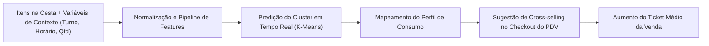

# Sistema de Análise Preditiva e Recomendação de Produtos em PDV de Feiras Gastronômicas — KAlimentos

[](https://www.python.org/)
[](https://scikit-learn.org/)
[](https://pandas.pydata.org/)
[](https://faculdadeamf.edu.br/)

Este repositório contém o desenvolvimento do **Trabalho 1 da disciplina de Inteligência Artificial II (2026/02)** do curso de **Sistemas de Informação da Faculdade Antonio Meneghetti (AMF)**, sob docência do **Prof. Rhauani Fazul**.

O projeto concebe uma arquitetura de Machine Learning voltada ao **Ponto de Venda (PDV)** da empresa **KAlimentos**, especializada em doces coloniais e confeitaria regional (cucas alemãs, alfajores, rapaduras artesanais, amendoins confeitados e bolachas). Utilizando dados reais de transações de feiras e exposições agropecuárias do Rio Grande do Sul, o sistema implementa algoritmos de **Clusterização (K-Means)** para segmentação de padrões de compra e suporte à decisão em tempo real através de um **mecanismo de recomendação de produtos no checkout (cross-selling/up-selling)** para incremento do ticket médio.

---

## 1. Visão Geral do Problema e Contexto de Negócio

### O Cenário de Feiras e Eventos Sazonais
As feiras de agronegócio e festivais culturais (ex.: *Expointer, ExpoDireto, ExpoBento, Fenarroz, Expo Afubra*) concentram um fluxo intenso e intermitente de clientes em curtos períodos de tempo. No balcão de vendas de produtos alimentícios artesanais:
- O atendimento ao cliente deve ser extremamente rápido para evitar filas.
- Grande parte dos clientes não possui cadastro prévio identificado (`cliente_id is null`), inviabilizando abordagens de recomendação baseadas em filtragem colaborativa tradicional centrada no histórico do usuário.
- O atendente frequentemente perde oportunidades de realizar **venda casada (cross-selling)** por não reconhecer de imediato a "cesta" e o momento de compra do cliente.

### A Solução Proposta
A partir dos dados transacionais do pedido no instante do atendimento (itens já adicionados à cesta, horário, turno da feira, quantidade de itens e valor parcial), o sistema classifica o pedido em um **Cluster de Perfil de Consumo**. Com base nesse agrupamento dinâmico, o motor de regras do PDV sugere instantaneamente ao operador um produto complementar estratégico para ser ofertado antes do fechamento da venda.



---

## 2. Estrutura do Repositório

A organização do projeto segue as melhores práticas de engenharia de dados e separação de responsabilidades:

```text
.
├── .agents/
│   └── AGENTS.md                   # Configurações de agentes operacionais e regras do Antigravity CLI
├── content/                        # Materiais pedagógicos e teóricos das disciplinas (AMF)
│   ├── CD/                         # Slides, notebooks e ementa de Ciência de Dados
│   ├── IA-1/                       # Slides e fundamentos de IA I (ML Clássico, NNs, GenAI)
│   └── IA-2/                       # Slides de IA II, códigos de apoio e diretrizes do Trabalho 1
│       ├── codigos/7 - clustering/ # Implementações de referência (K-Means, DBSCAN, PCA, Perfil)
│       └── Trabalho 1 - Inteligência Artificial II.pdf
├── reports/                        # Entregáveis técnicos e relatórios finais da disciplina
│   ├── figures/                    # Gráficos e diagnósticos exportados em alta resolução
│   ├── .gitkeep
│   └── relatorio_final.pdf         # Relatório técnico obrigatório da entrega acadêmica
├── studing/                        # Datasets brutos e estudos preliminares
│   ├── KalimentosFeirasVendas.csv  # Dataset oficial de transações de PDV da KAlimentos
│   ├── bread_basket.csv            # Dataset público de referência de PDV
│   └── BNPL_Financial_Default_Risk_Dataset.csv
├── AGENTS.md                       # Harness operacional de agentes, guardrails e especificações de IA
├── base.csv                        # Dataset processado e enriquecido após EDA e Feature Engineering
├── cli.py                          # Interface simples de linha de comando para testar o checkout
├── demo.sh                         # Script executável de demonstração prática e apresentação
├── diario_de_bordo.md              # Diário de bordo cronológico das etapas e decisões do projeto
├── eda.ipynb                       # Notebook 1: Análise Exploratória de Dados inicial e auditoria
├── eda_v2.ipynb                    # Notebook 2: Normalização de tipos, agrupamento semântico, ML e exportação
├── get_dataset.sql                 # Query SQL de extração do banco relacional PostgreSQL de produção
├── modelo_checkout.joblib          # Modelo K-Means e encoders exportados pelo eda_v2.ipynb
├── README.md                       # Documentação central do repositório
└── requirements.txt                # Dependências exatas congeladas do ambiente virtual
```

---

## 3. Pipeline de Dados (EDA & Feature Engineering)

### 3.1. Origem e Granularidade dos Dados
Os dados brutos foram extraídos do banco de dados operacional de vendas da empresa via query SQL ([`get_dataset.sql`](file:///home/lucas/Projects/EDA/get_dataset.sql)), padronizando o fuso horário para `America/Sao_Paulo`.

- **Granularidade:** Transações no **nível de item do pedido** (`itens_pedido` associados a `pedidos` e `finance_events`).
- **Volume:** **3.115 registros brutos**, saneados para **3.113 registros de itens efetivamente comercializados** (após descarte de 2 registros fantasmas com quantidade zerada no PDV) distribuídos em **2.457 pedidos únicos** (100% dos pedidos preservados), cobrindo o período de março a setembro de 2026.
- **Feiras contempladas:** 12 eventos regionais com predominância de *Expointer 2026* (705 itens), *Expo Afubra* (610 itens após saneamento), *Wolksfest Agudo* (424 itens), *ExpoDireto* (405 itens) e *EXPOBENTO* (303 itens após saneamento).

### 3.2. Limpeza e Tratamento dos Dados
1. **Auditoria de Integridade Financeira:** Foi verificado que $100\%$ dos registros satisfazem a relação:
   $$\text{pedido\_subtotal} - \text{pedido\_valor\_desconto} = \text{valor\_final\_pedido}$$
   Isso permitiu descartar com segurança a coluna redundante `pedido_tipo_desconto`.
2. **Eliminação de Colunas Irrelevantes e Inconsistentes:**
   - Descarte das datas de vigência do evento (`evento_data_inicio`, `evento_data_fim`).
   - Descarte de `item_pedido_user_id` e `pedido_vendedor`: nas feiras, múltiplos atendentes operam o mesmo terminal de caixa sob a mesma credencial de login. Esse dado não reflete a autoria fidedigna do atendimento, além de ser irrelevante para o agrupamento de cestas de consumo.
3. **Saneamento de Registros Espúrios com Quantidade Zerada:**
   - Descarte de 2 registros fantasmas com quantidade zerada ($\le 0$) decorrentes de cancelamentos operacionais no PDV: um item de alfajor na Expo Afubra e uma rapadura na EXPOBENTO.
   - **Conservação Contábil:** Em ambos os pedidos, a remoção da linha zerada conservou 100% do subtotal original (R$ 20,00), mantendo todos os 2.457 pedidos íntegros e ajustando com exatidão a diversidade real da cesta (`qnt_repeticoes`).
4. **Tratamento de Datas e Fusos:** Conversão de strings timestamp mistas para `datetime64[ns, America/Sao_Paulo]` com inferência robusta.
5. **Validação de Integridade Transacional (Data Quality — Itens vs. Subtotal):**
   - Comparação da soma dos itens $\sum(\text{quantidade} \times \text{preço\_unitário})$ contra o `pedido_subtotal` com tolerância de $R\$\,0,01$.
   - **Resultado Bruto Inicial:** **94,34% (2.318 pedidos)** apresentam cálculo perfeito, enquanto **5,66% (139 pedidos)** apresentam discrepâncias severas causadas pelo apontamento de preços de embalagens fechadas (*Caixa x16*, *Pacote x6*, etc.) mantendo a quantidade de unidades avulsas.
6. **Mecanismo de Correção por Proporção com Fallback Condicional (Double-Check sem Magic Numbers):**
   - Em conformidade com o princípio da **não-destrutividade**, os dados brutos originais foram preservados em colunas próprias e os valores proporcionais derivados em novas colunas (`quantidade_ajustada`, `preco_unitario_ajustado`, `valor_item_ajustado`, `tipo_escala`).
   - **Identificação Estatística de Escala:** Em vez de constantes ou números mágicos arbitrários, o modelo compara a proximidade do preço à mediana do SKU ($|\frac{P}{k} - \tilde{P}_{\text{SKU}}| < |P - \tilde{P}_{\text{SKU}}|$), preservando flutuações unitárias legítimas (R$ 5 a R$ 7) e identificando preços de embalagem fechada.
   - **Orquestração de Fallback e Harmonização:** Se o cálculo tradicional bate com o subtotal contábil ($\Delta \le 0,01$), os dados originais são mantidos (`status_validacao = 'ORIGINAL_VALIDO'`: 2.318 pedidos). Se o tradicional divergir mas a proporção do fator $k$ fechar o subtotal, o valor proporcional é adotado (`status_validacao = 'AJUSTADO_PROPORCAO'`: 139 pedidos). Para vendas de pacotes fechados em unidades unitárias, a harmonização converte para unidades físicas de consumo sem alterar o subtotal.
   - **Resultado Consolidado e Auditoria Global Pré-Seção 5 (Subseção 4.6.6):** Prova real conclusiva sobre 100% dos 2.457 pedidos e 3.113 itens, confirmando que $\sum (\text{quantidade\_ajustada} \times \text{preco\_unitario\_ajustado}) == \text{pedido\_subtotal}$ nos 139 pedidos com ajuste e $\sum (\text{quantidade\_final} \times \text{preco\_unitario\_final}) == \text{pedido\_subtotal}$ em todo o dataset (**100,00% de conformidade contábil**, 0 regressões, 0 pedidos em quarentena residual e maior delta absoluto de R$ 0,000000).


### 3.3. Engenharia de Atributos (Feature Engineering)
As transformações desenvolvidas em [`eda_v2.ipynb`](file:///home/lucas/Projects/EDA/eda_v2.ipynb) resultaram no dataset consolidado [`base.csv`](file:///home/lucas/Projects/EDA/base.csv), estruturado com total transparência de linhagem:

| Atributo Criado / Tratado | Tipo | Descrição e Racional Técnico |
| :--- | :--- | :--- |
| `nome_produto_bruto` | Texto | Nome original de cadastro preservado para fins de auditoria e rastreabilidade. |
| `nome_produto` | Categórico | Nome canônico padronizado após consolidação semântica de famílias. |
| `fator_k` | Inteiro | Multiplicador de embalagem extraído via regex (`x16`, `x6`, `x4`, etc.). |
| `tipo_escala` | Texto | Diagnóstico estatístico da escala do item (`UNITARIO`, `PACOTE_FRACIONADO`, `PRECO_EMBALAGEM_CORRIGIDO`). |
| `status_validacao` | Texto | Rótulo de auditoria do fallback (`ORIGINAL_VALIDO` vs. `AJUSTADO_PROPORCAO`). |
| `quantidade_final` | Inteiro | Volume numérico harmonizado em unidades físicas reais de consumo. |
| `preco_unitario_final` | Float | Preço unitário real por unidade física (desvio padrão estabilizado). |
| `valor_item_final` | Float | Total monetário faturado na linha do pedido ($\text{quantidade\_final} \times \text{preco\_final}$). |
| `qnt_repeticoes` | Categórico / Inteiro | Contagem de itens no mesmo `pedido_id` (indicador de diversidade da cesta). |
| `mes` | Inteiro (1–12) | Mês da feira (captura de sazonalidade anual). |
| `dia_semana` | Inteiro (0–6) | Dia da semana (0=Segunda-feira a 6=Domingo), diferenciando dias úteis e fins de semana. |
| `dia_horario` | Inteiro (0–23) | Hora inteira da transação (picos de almoço, tarde e encerramento). |
| `turno` | Categórico | Segmentação temporal via `pd.cut`: *Madrugada*, *Manhã*, *Tarde*, *Noite*. |
| `metodo_pagamento` | Categórico | Meio de pagamento utilizado (*Dinheiro*, *Cartão*, *Pix*). |

### 3.4. Normalização Textual e Agrupamento Semântico de Produtos
No PDV original, variações de apresentação do mesmo produto apareciam como strings distintas (ex.: displays, caixas com 16 unidades, pacotes com 4 unidades ou potes). Para viabilizar a clusterização sem dispersão excessiva de dimensionalidade:
- Aplicou-se remoção de espaços nas extremidades (`strip`), substituição de espaços por sublinhados (`_`) e conversão para maiúsculas (`upper`).
- Unificaram-se variações semânticas em famílias de produtos:
  - `ALFAJOR_PRETO`, `ALFAJOR_BRANCO`, `ALFAJOR_PRETO_(CAIXA_X16)` $\rightarrow$ `ALFAJOR`
  - `CUCA_ENROLADA_DE_AMENDOIM`, `CUCA_ENROLADA_DE_CHOCOLATE` $\rightarrow$ `CUCA_ENROLADA`
  - `RAPADURA_DE_MELADO`, `RAPADURA_DE_MELADO_GRÃO_MOÍDO` $\rightarrow$ `RAPADURA_MELADO`
  - `BOLACHA_DE_MANTEIGA`, `BOLACHA_DE_MILHO` $\rightarrow$ `BOLACHA`
  - `AMENDOIM_SALGADO_E_TEMPERADO`, `AMENDOIM_TEMPERADO_100G` $\rightarrow$ `AMENDOIM_TEMPERADO`

---

## 4. Modelagem de Machine Learning e Recomendador

### 4.1. Algoritmo de Clusterização (K-Means) e Otimização de Hiperparâmetros ($K$)
Optou-se pelo **K-Means Clustering** como técnica primordial não supervisionada, alinhando-se aos materiais pedagógicos da disciplina ([`content/IA-2/codigos/7 - clustering/1_kmeans.py`](file:///home/lucas/Projects/EDA/content/IA-2/codigos/7%20-%20clustering/1_kmeans.py)):

- **Padronização:** As 8 variáveis de decisão (`dia_horario`, `prod_code`, `metodo_code`, `turno_code`, `preco_unitario_final`, `quantidade_final`, `valor_final_pedido`, `qnt_repeticoes_num`) são escalonadas com `StandardScaler` (média zero e desvio unitário) para evitar viés de magnitude monetária sobre grandezas temporais.
- **Definição Matemática de $K$:** Varredura sistemática de $K \in [2, 8]$ confrontando a Inércia (WCSS / Método do Cotovelo), Coeficiente de Silhueta, Calinski-Harabasz e Davies-Bouldin:
  - O **Score Calinski-Harabasz atinge seu ápice absoluto em $K=5$ (788.31)**, superando $K=4$ (732.19) e $K=6$ (759.68).
  - A curva de inércia apresenta estabilização e ponto de cotovelo entre 4 e 5 clusters.
  - Artefato gerado: [`reports/figures/01_otimizacao_k_cotovelo_silhueta.png`](file:///home/lucas/Projects/EDA/reports/figures/01_otimizacao_k_cotovelo_silhueta.png).

### 4.2. Caracterização Semântica e Perfil Operacional dos 5 Clusters
A análise dos centróides padronizados (Z-Score) e médias empíricas revelou 5 segmentos nítidos no PDV:

| Cluster | Nome Operacional | % Base | Horário Médio | Qtd Média | Preço Unit. | Ticket Médio | SKU Predominante |
| :---: | :--- | :---: | :---: | :---: | :---: | :---: | :--- |
| **C0** | **Cuca Matinal (Abertura)** | 15,8% | 10,0h (Manhã) | 2,69 un | R$ 11,78 | R$ 29,38 | `CUCA_ALEMÃ` |
| **C1** | **Doces Tradicionais (Tarde)** | 33,4% | 15,7h (Tarde) | 2,78 un | R$ 7,07 | R$ 34,67 | `RAPADURA_MELADO` |
| **C2** | **Padaria Familiar (Cuca Inteira)**| 30,2% | 15,6h (Tarde) | 1,34 un | R$ 22,13 | R$ 32,60 | `CUCA_ALEMÃ` |
| **C3** | **Lanche Rápido (Alfajor)** | 20,1% | 15,7h (Tarde) | 2,83 un | R$ 6,44 | R$ 44,92 | `ALFAJOR` |
| **C4** | **Atacado / Grandes Encomendas** | 0,4% | 14,8h (Tarde) | 86,62 un | R$ 10,42 | R$ 2.839,38 | `RAPADURA_ASSADA` |

- Artefato de Interpretação: [`reports/figures/04_heatmap_centroides_clusters.png`](file:///home/lucas/Projects/EDA/reports/figures/04_heatmap_centroides_clusters.png).

### 4.3. Suite Visual Multidimensional com PCA (2D Biplot e 3D)
Para superar as limitações de dispersões bidimensionais arbitrárias com eixos categóricos:
1. **PCA 2D com Biplot de Cargas:** Projeção linear retendo **40,5% da variância**. $\text{PC}_1$ (23,2%) condensa a dimensão de volume/valor da cesta e $\text{PC}_2$ (17,3%) condensa a dimensão temporal. As setas vetoriais (*loadings*) tornam a leitura dos eixos imediata.
   - Artefato: [`reports/figures/02_pca_2d_clusters_biplot.png`](file:///home/lucas/Projects/EDA/reports/figures/02_pca_2d_clusters_biplot.png).
2. **PCA 3D (`Axes3D`):** Eleva a variância retida para **54,2%**, isolando no eixo vertical ($\text{PC}_3$ — 13,7%) a diferenciação por preço unitário do item (produtos populares vs. padaria colonial artesanal).
   - Artefato: [`reports/figures/03_pca_3d_clusters.png`](file:///home/lucas/Projects/EDA/reports/figures/03_pca_3d_clusters.png).

### 4.4. Motor de Recomendação no Checkout (Cross-Selling em Tempo Real)
Demonstrado na Seção 8.6 de [`eda_v2.ipynb`](file:///home/lucas/Projects/EDA/eda_v2.ipynb), o motor realiza a inferência determinística para qualquer carrinho em tempo de fechamento:
- **Exemplo Real:** Novo cliente comprando 1 Alfajor avulso (R$ 6,00) às 16:00.
- **Classificação:** Mapeado instantaneamente no cluster **C3 (Lanche Rápido / Alfajor)**.
- **Ação no PDV:** Disparo do gatilho *"Sugestão PDV: Leve mais 3 Alfajores com desconto progressivo no pacote x4!"*.
- Artefato Visual de Inferência: [`reports/figures/05_simulacao_checkout_recomendacao.png`](file:///home/lucas/Projects/EDA/reports/figures/05_simulacao_checkout_recomendacao.png).

### 4.5. Exportação do Modelo e CLI Simples no Checkout
No final do notebook [`eda_v2.ipynb`](file:///home/lucas/Projects/EDA/eda_v2.ipynb) (Seção 8.7), o modelo treinado `kmeans`, o `StandardScaler`, os encoders e os dicionários de regras são exportados para o arquivo consolidado [`modelo_checkout.joblib`](file:///home/lucas/Projects/EDA/modelo_checkout.joblib).
A inferência em tempo de venda é executada diretamente através do script [`cli.py`](file:///home/lucas/Projects/EDA/cli.py).

---

## 5. Como Reproduzir o Ambiente e Execução

### Pré-requisitos
- Python `3.10` ou superior (testado e homologado em **Python 3.14.7**).
- Git configurado.

### 1. Clonar o Repositório
```bash
git clone git@github.com:SIS-AMF/2026-2_trablho-g1-cd-ai2.git
cd 2026-2_trablho-g1-cd-ai2
```

### 2. Configurar o Ambiente Virtual
```bash
python3 -m venv .venv
source .venv/bin/activate  # No Linux/macOS
# .venv\Scripts\activate   # No Windows
```

### 3. Instalar as Dependências
```bash
pip install --upgrade pip
pip install -r requirements.txt
```

### 4. Treinar e Exportar o Modelo
1. **Auditoria Exploratória:** Executar [`eda.ipynb`](file:///home/lucas/Projects/EDA/eda.ipynb).
2. **Engenharia de Dados e Treinamento:** Executar [`eda_v2.ipynb`](file:///home/lucas/Projects/EDA/eda_v2.ipynb).
   - O notebook processará [`studing/KalimentosFeirasVendas.csv`](file:///home/lucas/Projects/EDA/studing/KalimentosFeirasVendas.csv), gerará [`base.csv`](file:///home/lucas/Projects/EDA/base.csv), treinará o K-Means e salvará [`modelo_checkout.joblib`](file:///home/lucas/Projects/EDA/modelo_checkout.joblib) na Seção 8.7.

### 5. Executar o CLI de Recomendação
Com o modelo exportado, execute simulações diretamente pelo terminal informando os parâmetros obrigatórios da transação (nenhum default é assumido para garantir fidelidade à simulação):

```bash
# Consultar catálogo completo de produtos e formas de pagamento válidas
python cli.py --listar

# Simulação 1: Lanche Rápido (Alfajor à tarde)
python cli.py --produto "Alfajor Preto" --hora 16 --preco 6.0 --quantidade 1 --metodo Dinheiro --itens 1

# Simulação 2: Cuca Matinal (Café da manhã na abertura da feira)
python cli.py --produto "Cuca Alemã" --hora 10 --preco 22.0 --quantidade 2 --metodo Pix --itens 1

# Simulação 3: Atacado e Grandes Encomendas
python cli.py --produto "Rapadura Assada" --hora 15 --preco 10.0 --quantidade 80 --metodo Dinheiro --itens 5
```

### 6. Roteiro de Apresentação Prática (`demo.sh`)
O arquivo [`demo.sh`](file:///home/lucas/Projects/EDA/demo.sh) contém a lista comentada dos comandos prontos para serem executados ou copiados e colados um a um no terminal durante a apresentação:
- Consulta do catálogo (`--listar`);
- Demonstração dos 5 perfis de clientes/clusters ($C_0$ a $C_4$);
- Demonstração dos guardrails (sem defaults, typo inteligente e pagamento inválido).

Você pode abrir o arquivo [`demo.sh`](file:///home/lucas/Projects/EDA/demo.sh) e executar cada comando individualmente conforme sua fala na apresentação.

---

## 7. Entregáveis Acadêmicos e Metadados do Projeto

- **Instituição:** Faculdade Antonio Meneghetti (AMF)
- **Curso:** Bacharelado em Sistemas de Informação
- **Disciplina:** Inteligência Artificial II (2026/02)
- **Relatório Técnico Obrigatório:** [`reports/relatorio_final.pdf`](file:///home/lucas/Projects/EDA/reports/relatorio_final.pdf)
- **Diretrizes de Agentes e Harness:** [`AGENTS.md`](file:///home/lucas/Projects/EDA/AGENTS.md)
