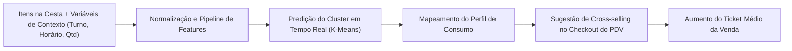

# Sistema de Análise Preditiva e Recomendação de Produtos em PDV de Feiras Gastronômicas — KAlimentos

[](https://www.python.org/)
[](https://scikit-learn.org/)
[](https://pandas.pydata.org/)
[](https://faculdadeamf.edu.br/)

Este repositório contém o desenvolvimento do **Trabalho 1 da disciplina de Inteligência Artificial II (2026/02)** do curso de **Sistemas de Informação da Faculdade Antonio Meneghetti (AMF)**, sob docência do **Prof. Rhauani Fazul**.

O projeto concebe uma arquitetura de Machine Learning voltada ao **Ponto de Venda (PDV)** da empresa **KAlimentos**, especializada em doces coloniais e confeitaria regional (cucas alemãs, alfajores, rapaduras artesanais, amendoins confeitados e bolachas). Utilizando dados reais de transações de feiras e exposições agropecuárias do Rio Grande do Sul, o sistema implementa algoritmos de **Clusterização (K-Means)** para segmentação de padrões de compra e suporte à decisão em tempo real através de um **mecanismo de recomendação de produtos no checkout (cross-selling/up-selling)** para incremento do ticket médio.

---

## 1. Visão Geral do Problema e Contexto de Negócio

### O Cenário de Feiras e Eventos Sazonais
As feiras de agronegócio e festivais culturais (ex.: *Expointer, ExpoDireto, ExpoBento, Fenarroz, Expo Afubra*) concentram um fluxo intenso e intermitente de clientes em curtos períodos de tempo. No balcão de vendas de produtos alimentícios artesanais:
- O atendimento ao cliente deve ser extremamente rápido para evitar filas.
- Grande parte dos clientes não possui cadastro prévio identificado (`cliente_id is null`), inviabilizando abordagens de recomendação baseadas em filtragem colaborativa tradicional centrada no histórico do usuário.
- O atendente frequentemente perde oportunidades de realizar **venda casada (cross-selling)** por não reconhecer de imediato a "cesta" e o momento de compra do cliente.

### A Solução Proposta
A partir dos dados transacionais do pedido no instante do atendimento (itens já adicionados à cesta, horário, turno da feira, quantidade de itens e valor parcial), o sistema classifica o pedido em um **Cluster de Perfil de Consumo**. Com base nesse agrupamento dinâmico, o motor de regras do PDV sugere instantaneamente ao operador um produto complementar estratégico para ser ofertado antes do fechamento da venda.



---

## 2. Estrutura do Repositório

A organização do projeto segue as melhores práticas de engenharia de dados e separação de responsabilidades:

```text
.
├── .agents/
│   └── AGENTS.md                   # Configurações de agentes operacionais e regras do Antigravity CLI
├── content/                        # Materiais pedagógicos e teóricos das disciplinas (AMF)
│   ├── CD/                         # Slides, notebooks e ementa de Ciência de Dados
│   ├── IA-1/                       # Slides e fundamentos de IA I (ML Clássico, NNs, GenAI)
│   └── IA-2/                       # Slides de IA II, códigos de apoio e diretrizes do Trabalho 1
│       ├── codigos/7 - clustering/ # Implementações de referência (K-Means, DBSCAN, PCA, Perfil)
│       └── Trabalho 1 - Inteligência Artificial II.pdf
├── reports/                        # Entregáveis técnicos e relatórios finais da disciplina
│   ├── .gitkeep
│   └── relatorio_final.pdf         # Relatório técnico obrigatório da entrega acadêmica
├── studing/                        # Datasets brutos e estudos preliminares
│   ├── KalimentosFeirasVendas.csv  # Dataset oficial de transações de PDV da KAlimentos
│   ├── bread_basket.csv            # Dataset público de referência de PDV
│   └── BNPL_Financial_Default_Risk_Dataset.csv
├── AGENTS.md                       # Harness operacional de agentes, guardrails e especificações de IA
├── base.csv                        # Dataset processado e enriquecido após EDA e Feature Engineering
├── diario_de_bordo.md              # Diário de bordo cronológico das etapas e decisões do projeto
├── eda.ipynb                       # Notebook 1: Análise Exploratória de Dados inicial e auditoria
├── eda_v2.ipynb                    # Notebook 2: Normalização de tipos, agrupamento semântico e ML
├── get_dataset.sql                 # Query SQL de extração do banco relacional PostgreSQL de produção
├── README.md                       # Documentação central do repositório
└── requirements.txt                # Dependências exatas congeladas do ambiente virtual
```

---

## 3. Pipeline de Dados (EDA & Feature Engineering)

### 3.1. Origem e Granularidade dos Dados
Os dados brutos foram extraídos do banco de dados operacional de vendas da empresa via query SQL ([`get_dataset.sql`](file:///home/lucas/Projects/EDA/get_dataset.sql)), padronizando o fuso horário para `America/Sao_Paulo`.

- **Granularidade:** Transações no **nível de item do pedido** (`itens_pedido` associados a `pedidos` e `finance_events`).
- **Volume:** **3.115 registros** de itens vendidos em **2.457 pedidos únicos**, cobrindo o período de março a setembro de 2026.
- **Feiras contempladas:** 12 eventos regionais com predominância de *Expointer 2026* (705 itens), *Expo Afubra* (611 itens), *Wolksfest Agudo* (424 itens), *ExpoDireto* (405 itens) e *EXPOBENTO* (304 itens).

### 3.2. Limpeza e Tratamento dos Dados
1. **Auditoria de Integridade Financeira:** Foi verificado que $100\%$ dos registros satisfazem a relação:
   $$\text{pedido\_subtotal} - \text{pedido\_valor\_desconto} = \text{valor\_final\_pedido}$$
   Isso permitiu descartar com segurança a coluna redundante `pedido_tipo_desconto`.
2. **Eliminação de Colunas Irrelevantes:** Foram descartadas as datas de vigência do evento (`evento_data_inicio`, `evento_data_fim`) e a coluna `item_pedido_user_id` (duplicada em relação a `pedido_vendedor`).
3. **Tratamento de Datas e Fusos:** Conversão de strings timestamp mistas para `datetime64[ns, America/Sao_Paulo]` com inferência robusta.

### 3.3. Engenharia de Atributos (Feature Engineering)
As transformações desenvolvidas em [`eda_v2.ipynb`](file:///home/lucas/Projects/EDA/eda_v2.ipynb) resultaram no dataset consolidado [`base.csv`](file:///home/lucas/Projects/EDA/base.csv):

| Atributo Criado / Tratado | Tipo | Descrição e Racional Técnico |
| :--- | :--- | :--- |
| `qnt_repeticoes` | Categórico / Inteiro | Contagem de linhas por `pedido_id`. Identifica a diversidade de itens no mesmo carrinho (compras simples vs. compras combinadas). |
| `mes` | Inteiro (1–12) | Mês do evento, permitindo capturar sazonalidades ao longo do ano. |
| `dia_semana` | Inteiro (0–6) | Dia da semana (0=Segunda-feira a 6=Domingo), diferenciando o fluxo de dias úteis e finais de semana da feira. |
| `dia_horario` | Inteiro (0–23) | Hora inteira da transação (picos de almoço, meio de tarde e fechamento de feira). |
| `turno` | Categórico | Binning temporal via `pd.cut`: *Madrugada* (0h–5h), *Manhã* (6h–11h), *Tarde* (12h–17h) e *Noite* (18h–23h). |
| `vendedor` | Binário | Codificação dos operadores de caixa via `LabelBinarizer`. |
| `payment_mathod` | Categórico | Forma de pagamento utilizada (*Dinheiro*: 58,4%, *Cartão*: 31,6%, *Pix*: 10,0%). |

### 3.4. Normalização Textual e Agrupamento Semântico de Produtos
No PDV original, variações de apresentação do mesmo produto apareciam como strings distintas (ex.: displays, caixas com 16 unidades, pacotes com 4 unidades ou potes). Para viabilizar a clusterização sem dispersão excessiva de dimensionalidade:
- Aplicou-se remoção de espaços nas extremidades (`strip`), substituição de espaços por sublinhados (`_`) e conversão para maiúsculas (`upper`).
- Unificaram-se variações semânticas em famílias de produtos:
  - `ALFAJOR_PRETO`, `ALFAJOR_BRANCO`, `ALFAJOR_PRETO_(CAIXA_X16)` $\rightarrow$ `ALFAJOR`
  - `CUCA_ENROLADA_DE_AMENDOIM`, `CUCA_ENROLADA_DE_CHOCOLATE` $\rightarrow$ `CUCA_ENROLADA`
  - `RAPADURA_DE_MELADO`, `RAPADURA_DE_MELADO_GRÃO_MOÍDO` $\rightarrow$ `RAPADURA_MELADO`
  - `BOLACHA_DE_MANTEIGA`, `BOLACHA_DE_MILHO` $\rightarrow$ `BOLACHA`
  - `AMENDOIM_SALGADO_E_TEMPERADO`, `AMENDOIM_TEMPERADO_100G` $\rightarrow$ `AMENDOIM_TEMPERADO`

---

## 4. Modelagem de Machine Learning e Recomendador

### 4.1. Algoritmo de Clusterização (K-Means)
Optou-se pelo **K-Means Clustering** como técnica não supervisionada primordial, seguindo as diretrizes pedagógicas da disciplina ([`content/IA-2/codigos/7 - clustering/1_kmeans.py`](file:///home/lucas/Projects/EDA/content/IA-2/codigos/7%20-%20clustering/1_kmeans.py)):

- **Padronização:** As variáveis contínuas e numéricas são escalonadas com `StandardScaler` (média zero e variância unitária) para impedir que valores monetários de pedidos dominem atributos temporais ou de contagem.
- **Escolha de $K$ (Número de Clusters):** Avaliado por meio da curva de inércia (Método do Cotovelo / *Elbow Method*) e coeficiente de silhueta (*Silhouette Score*), estabelecendo $K = 5$ clusters com convergência estável.
- **Redução de Dimensionalidade (PCA):** Aplicação de `PCA(n_components=2)` para projeção em 2 dimensões, viabilizando o diagnóstico visual e a verificação da separabilidade dos agrupamentos.

### 4.2. Caracterização dos Clusters Latentes

```text
[Cluster 0] - "Cesta Familiar Tradicional": Pedidos do turno da tarde com forte presença de Cucas Alemãs e Cucas Enroladas.
[Cluster 1] - "Lanche Rápido & Snack Individual": Transações de valor moderado com Alfajores avulsos e Amendoim Temperado.
[Cluster 2] - "Atacado / Presentes Coloniais": Grandes volumes compostos por caixas fechadas de rapaduras e bandejas de alfajor.
[Cluster 3] - "Compra Noturna de Impulso": Horários próximos ao encerramento, ticket médio menor, alta frequência de Pix/Cartão.
[Cluster 4] - "Mix Colonial Completo": Carrinhos com alta 'qnt_repeticoes' contendo doces secos (bolachas) associados a cucas.
```

### 4.3. Motor de Recomendação no Checkout (Cross-Selling)
Uma vez instanciado o modelo, a inferência em tempo de execução opera sob a seguinte lógica:

```python
def recomendar_item_checkout(cluster_id, itens_no_pedido):
    catalogo_recomendacao = {
        0: "☕ Recomendação: Adicionar Café Colonial ou Alfajor Tradicional para sobremesa.",
        1: "🥜 Recomendação: Leve um pacote de Amendoim Crocante ou Cri-Cri com desconto!",
        2: "🎁 Recomendação: Complete o kit com uma Cuca Alemã fresquinha com preço de combo.",
        3: "🍬 Recomendação: Que tal levar uma Rapadura de Melado artesanal para a viagem?",
        4: "🍪 Recomendação: Pacote de Bolachas Coloniais de Manteiga para o café da manhã."
    }
    return catalogo_recomendacao.get(cluster_id, "💡 Sugestão: Cuca Alemã Tradicional")
```

---

## 5. Como Reproduzir o Ambiente e Execução

### Pré-requisitos
- Python `3.10` ou superior (testado e homologado em **Python 3.14.7**).
- Git configurado.

### 1. Clonar o Repositório
```bash
git clone git@github.com:SIS-AMF/2026-2_trablho-g1-cd-ai2.git
cd 2026-2_trablho-g1-cd-ai2
```

### 2. Configurar o Ambiente Virtual
```bash
python3 -m venv .venv
source .venv/bin/activate  # No Linux/macOS
# .venv\Scripts\activate   # No Windows
```

### 3. Instalar as Dependências
```bash
pip install --upgrade pip
pip install -r requirements.txt
```

### 4. Ordem de Execução do Pipeline
Para refazer os experimentos e gerar a base de dados tratada:
1. **Auditoria Exploratória:** Executar [`eda.ipynb`](file:///home/lucas/Projects/EDA/eda.ipynb) para inspecionar os tipos e distribuições brutas.
2. **Engenharia de Recursos e Base Limpa:** Executar [`eda_v2.ipynb`](file:///home/lucas/Projects/EDA/eda_v2.ipynb). Isso processará [`studing/KalimentosFeirasVendas.csv`](file:///home/lucas/Projects/EDA/studing/KalimentosFeirasVendas.csv) e exportará [`base.csv`](file:///home/lucas/Projects/EDA/base.csv).
3. **Treinamento e Recomendador:** Rodar as células de modelagem K-Means e visualização gráfica integradas no notebook.

---

## 6. Entregáveis Acadêmicos e Metadados do Projeto

- **Instituição:** Faculdade Antonio Meneghetti (AMF)
- **Curso:** Bacharelado em Sistemas de Informação
- **Disciplina:** Inteligência Artificial II (2026/02)
- **Docente Responsável:** Prof. Rhauani Fazul ([`@rwfazul`](https://github.com/rwfazul))
- **Autor / Discente:** Lucas G. Feldmann ([`@lucasgfeldmann`](https://github.com/lucasgfeldmann) — `lucasgfeldmann@gmail.com`)
- **Data Limite de Entrega:** 21 de setembro de 2026, às 12h00m
- **Relatório Técnico Obrigatório:** [`reports/relatorio_final.pdf`](file:///home/lucas/Projects/EDA/reports/relatorio_final.pdf)
- **Diretrizes de Agentes e Harness:** [`AGENTS.md`](file:///home/lucas/Projects/EDA/AGENTS.md)
