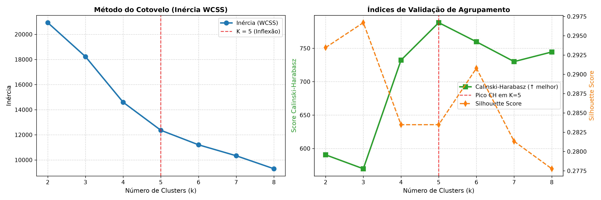
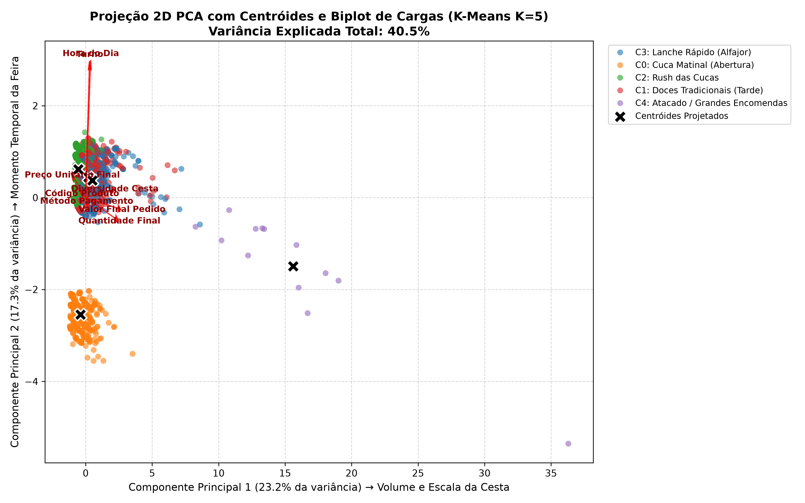
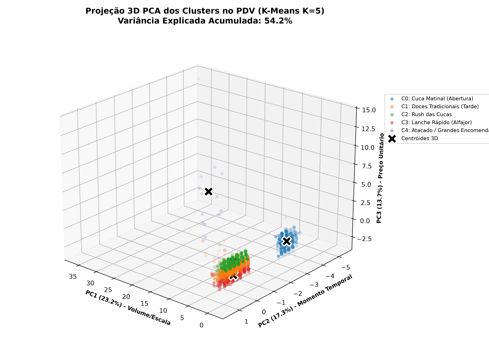
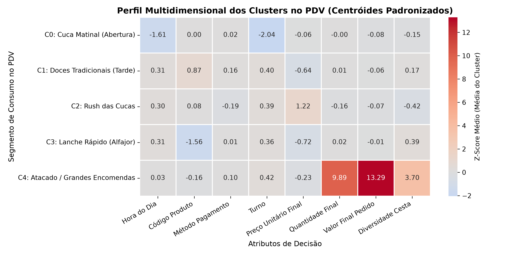
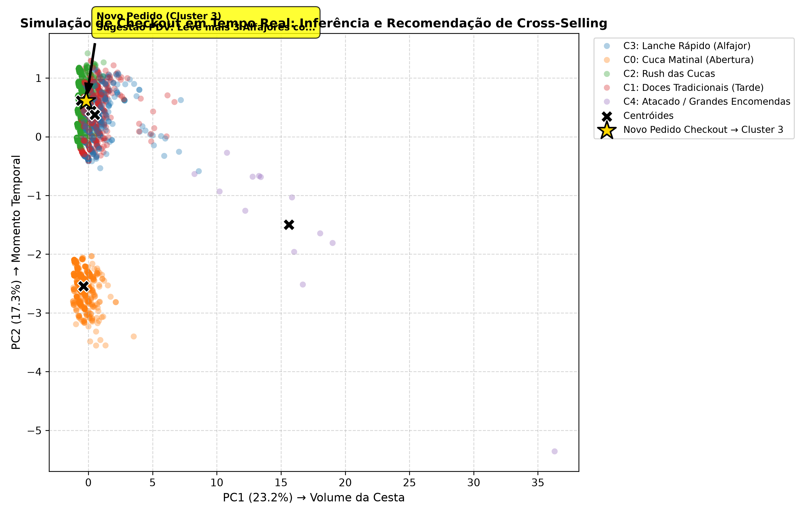

# Relatório Técnico: Agrupamento de Pedidos e Recomendação no Checkout (KAlimentos)

**Instituição:** Faculdade Antonio Meneghetti (AMF)  
**Curso:** Bacharelado em Sistemas de Informação  
**Disciplina:** Inteligência Artificial II (2026/02)  
**Docente:** Prof. Rhauani Fazul  
**Discente:** Lucas  
**Repositório Oficial:** [https://github.com/SIS-AMF/2026-2_trablho-g1-cd-ai2](https://github.com/SIS-AMF/2026-2_trablho-g1-cd-ai2)  

---

## 1. Dataset

### 1.1 Link de Acesso e Rastreabilidade
O dataset do projeto está versionado no repositório GitHub do trabalho ([`https://github.com/SIS-AMF/2026-2_trablho-g1-cd-ai2`](https://github.com/SIS-AMF/2026-2_trablho-g1-cd-ai2)), estruturado em dois artefatos centrais:
- **Dado Bruto e Imutável:** [`studing/KalimentosFeirasVendas.csv`](../studing/KalimentosFeirasVendas.csv), extraído por meio da consulta SQL relacional de produção [`get_dataset.sql`](../get_dataset.sql).
- **Dado Processado e Enriquecido:** [`base.csv`](../base.csv), gerado pelo pipeline de engenharia e saneamento de dados com 16 colunas finais íntegras.

### 1.2 Descrição, Origem e Granularidade
Os dados foram extraídos diretamente do banco de dados relacional (PostgreSQL) do sistema de Ponto de Venda (PDV) da empresa de confeitaria e panificação colonial **KAlimentos**. Os registros cobrem as vendas efetuadas em estandes de 12 feiras agropecuárias e gastronômicas regionais no Estado do Rio Grande do Sul (destacando-se *Expointer*, *Expo Afubra*, *ExpoDireto*, *Wolksfest Agudo* e *EXPOBENTO*) ao longo do período de março a setembro de 2026.

- **Granularidade:** Transações no **nível de item do pedido** (`itens_pedido` vinculados ao `pedido_id` e a eventos financeiros).
- **Volume:** O dataset bruto contém **3.115 registros**, que após auditoria e descarte de 2 registros fantasmas de quantidade zerada resultantes de cancelamento em caixa, totalizou **3.113 transações de itens comercializados**, abrangendo **2.457 pedidos únicos** (100% dos pedidos preservados).
- **Padronização Temporal:** Todos os registros temporais foram normalizados para o fuso horário local oficial `America/Sao_Paulo`.

### 1.3 Justificativa de Adequação ao Problema
As transações de feiras agropecuárias são realizadas no balcão presencial sem qualquer identificador ou cadastro individual do cliente (vendas anônimas). O dataset registra com precisão os produtos comercializados, quantidades, preços unitários, descontos, subtotal, meio de pagamento e carimbo de data/hora. Essa estrutura reflete integralmente o contexto operacional real do PDV, sendo estritamente adequada para a formulação de modelos não supervisionados de agrupamento de pedidos para identificar comportamentos de consumo da cesta e janelas temporais de venda.

---

## 2. Problema e objetivo

### 2.1 Situação Analisada
A KAlimentos opera sob regime de alta rotatividade de público em feiras itinerantes. O atendimento de balcão é dinâmico, sem cadastro prévio de clientes e com equipe de atendimento focada na agilidade operacional. Nesse cenário, inexiste histórico individual de recompra ou perfil demográfico, demandando que qualquer estratégia de inteligência seja baseada exclusivamente nas características observáveis do próprio pedido em andamento (horário, turno, itens na cesta e valores envolvidos).

### 2.2 Objetivo do Projeto
O objetivo central consiste em **classificar e agrupar pedidos** transacionados no PDV a partir de suas características contextuais (momento do dia), composição da cesta (volume, quantidade de itens, diversidade) e magnitude monetária (preço unitário e valor total do pedido), identificando tipologias homogêneas de consumo.

### 2.3 Aplicação Prática Futura
Como hipótese de uso prático futuro, os agrupamentos obtidos subsidiarão um **motor de recomendação de produtos no checkout** caso a operação de vendas venha a migrar para um canal de **e-commerce**. Ao submeter um carrinho em tempo real no fechamento da compra, o sistema infere o cluster correspondente ao pedido e dispara gatilhos de *cross-selling* com produtos complementares e descontos progressivos específicos daquele perfil.

### 2.4 Tipo de Tarefa de Machine Learning
A tarefa enquadra-se estritamente como **Aprendizado Não Supervisionado** (*Unsupervised Learning*), focada em **Agrupamento / Clusterização** (*Clustering*), sem variáveis-alvo pré-rotuladas.

---

## 3. Exploração e preparação dos dados

### 3.1 Auditoria de Qualidade e Integridade Financeira
A exploração inicial dos dados brutos validou a invariante contábil mandatória de fechamento de caixa:
$$\text{pedido\_subtotal} - \text{pedido\_valor\_desconto} \equiv \text{valor\_final\_pedido}$$
Em 100% dos registros analisados, a igualdade financeira manteve-se exata com tolerância zero ($\Delta = 0,00$, isto é, R$ 0,00 de resíduo), permitindo o descarte seguro do atributo redundante `pedido_tipo_desconto`.

### 3.2 Descarte de Atributos Irrelevantes e Inconsistentes
Foram eliminadas colunas operacionais que não agregam valor preditivo ou que apresentavam ruído cadastral:
- `evento_data_inicio` e `evento_data_fim`: Metadados administrativos do calendário das feiras que não influenciam a cesta imediata.
- `item_pedido_user_id` e `pedido_vendedor`: Nos estandes de feira, múltiplos operadores de caixa utilizam rotativamente o mesmo terminal sob login compartilhado, tornando o identificador de usuário espúrio e não correlacionado ao cliente final.

### 3.3 Tratamento de Nulos, Duplicidades e Cancelamentos no PDV
- **Valores Ausentes:** Zero valores nulos remanescentes nas colunas utilizadas para modelagem.
- **Saneamento de Registros Espúrios ($Q \le 0$):** Identificaram-se 2 registros fantasmas com quantidade zerada (`quantidade_item == 0`) decorrentes de cancelamentos operacionais no PDV (um item de alfajor na *Expo Afubra* e uma rapadura na *EXPOBENTO*). Em ambos os pedidos, a remoção do registro zerado manteve intacto o subtotal contábil de R$ 20,00 e corrigiu o indicador de diversidade da cesta (`qnt_repeticoes` de 2 para 1), preservando a totalidade dos 2.457 pedidos únicos e consolidando a base em 3.113 itens válidos.

### 3.4 Data Quality: Discrepâncias de Escala e Correção Proporcional
Na conferência da relação $\sum (\text{quantidade} \times \text{preço\_unitário}) == \text{pedido\_subtotal}$:
- **94,34% (2.318 pedidos):** Fechamento aritmético perfeito com dados originais.
- **5,66% (139 pedidos):** Discrepâncias decorrentes do lançamento manual de preços de caixas fechadas (*Caixa x16*, *Pacote x6*, etc.) atrelados a quantidades unitárias avulsas.

Para sanar o problema sem recorrer a constantes ou números mágicos arbitrários, implementou-se um mecanismo estatístico por proporção de escala ($k$) ancorado na mediana do SKU:
- Derivaram-se colunas auditáveis: `quantidade_ajustada`, `preco_unitario_ajustado` e `tipo_escala`.
- **Harmonização de Fardos:** 11 pedidos onde foram adquiridos fardos fechados unitários (ex.: 1 pacote de alfajor x4 a R$ 20,00) foram convertidos para unidades físicas de consumo ($Q_{\text{final}} = Q \times k$ e $P_{\text{final}} = P / k$), eliminando a dispersão artificial de preços.
- **Portão de Qualidade Contábil (Subseção 4.6.6 do Pipeline):** Auditoria global em 100% dos 2.457 pedidos atestando conformidade financeira absoluta: $\sum (\text{quantidade\_final} \times \text{preco\_unitario\_final}) == \text{pedido\_subtotal}$ com maior resíduo absoluto de **R$ 0,000000**.

### 3.5 Engenharia e Criação de Atributos
Foram geradas variáveis analíticas a partir do carimbo temporal e da estrutura dos pedidos:
- `dia_horario`: Hora inteira da venda (0 a 23).
- `dia_semana`: Dia da semana (0=Segunda a 6=Domingo).
- `mes`: Mês da realização da feira (3 a 9).
- `turno`: Segmentação temporal em *Madrugada* (0h–5h), *Manhã* (6h–11h), *Tarde* (12h–17h) e *Noite* (18h–23h).
- `qnt_repeticoes`: Contagem de linhas associadas ao mesmo `pedido_id`, mensurando a diversidade da cesta de compras.

### 3.6 Normalização Semântica de Produtos
Variações de cadastro textual de um mesmo produto foram unificadas em famílias semânticas padronizadas:
- `ALFAJOR_PRETO`, `ALFAJOR_BRANCO`, `ALFAJOR_(CAIXA_X16)` $\rightarrow$ `ALFAJOR`
- `CUCA_ENROLADA_DE_AMENDOIM`, `CUCA_ENROLADA_DE_CHOCOLATE` $\rightarrow$ `CUCA_ENROLADA`
- `RAPADURA_DE_MELADO`, `RAPADURA_DE_MELADO_GRÃO_MOÍDO` $\rightarrow$ `RAPADURA_MELADO`
- `RAPADURA_ASSADA`, `RAPADURA_ASSADA_(PACOTE_X6)` $\rightarrow$ `RAPADURA_ASSADA`
- `BOLACHA_DE_MANTEIGA`, `BOLACHA_DE_MILHO` $\rightarrow$ `BOLACHA`
- `AMENDOIM_SALGADO_E_TEMPERADO` $\rightarrow$ `AMENDOIM_TEMPERADO`

### 3.7 Codificação e Escalonamento
- **Codificação Categórica:** Emprego de `LabelEncoder` independente para `nome_produto` (`prod_code`), `metodo_pagamento` (`metodo_code`) e `turno` (`turno_code`).
- **Padronização:** As 8 variáveis do espaço vetorial (`dia_horario`, `prod_code`, `metodo_code`, `turno_code`, `preco_unitario_final`, `quantidade_final`, `valor_final_pedido`, `qnt_repeticoes_num`) foram submetidas ao `StandardScaler` ($\mu = 0, \sigma = 1$), impedindo que magnitudes monetárias ou volumétricas distorcessem o cálculo das distâncias euclidianas.

---

## 4. Estratégia experimental

### 4.1 Abordagem de Agrupamento Global
Tratando-se de Aprendizado Não Supervisionado para descoberta da estrutura latente e dos padrões naturais de compra da base histórica, o modelo K-Means foi treinado sobre o conjunto total consolidado ($N = 3.113$ itens em 2.457 pedidos). 

A aplicação de partições clássicas de treino e teste supervisionadas (ex.: 80/20) não é recomendada para este contexto analítico porque o particionamento arbitrário fragmentaria subpopulações raras e legítimas da operação (como o cluster de Atacado e Encomendas Corporativas, que possui 13 transações representativas), prejudicando a definição precisa dos centróides globais.

### 4.2 Protocolo Experimental e Reprodutibilidade
- **Determinismo:** Fixação irrestrita de sementes aleatórias em `random_state=42` com `n_init=10`.
- **Varredura de Hiperparâmetros:** Execução de varredura paramétrica para $K \in [2, 8]$, confrontando simultaneamente quatro indicadores quantitativos de clusterização: Inércia (WCSS / Método do Cotovelo), Coeficiente de Silhueta (*Silhouette Score*), Índice Calinski-Harabasz e Índice Davies-Bouldin.
- **Validação Prática:** Avaliação de estabilidade através de simulação de inferência em tempo real com novos registros de checkout no script de linha de comando.

---

## 5. Modelagem

### 5.1 Algoritmo de Agrupamento (K-Means)
Adotou-se o algoritmo **K-Means** (`sklearn.cluster.KMeans`), seguindo os fundamentos apresentados nas diretrizes didáticas da disciplina.

- **Hiperparâmetros Selecionados:**
  - `n_clusters=5`: Número ótimo de agrupamentos definido pela análise experimental.
  - `random_state=42`: Garantia de reprodutibilidade estocástica na inicialização.
  - `n_init=10`: Número de inicializações independentes do algoritmo $k\text{-means}++$ para seleção do melhor centróide inicial em termos de inércia mínima.

### 5.2 Redução de Dimensionalidade (PCA)
Para viabilizar a interpretabilidade geométrica das 8 dimensões padronizadas, utilizou-se a técnica de Análise de Componentes Principais (**PCA**):
- **PCA 2D (`n_components=2`):** Projeção linear no plano cartesiano combinada com o Biplot de Cargas Fatoriais (*loadings*).
- **PCA 3D (`n_components=3`):** Projeção tridimensional para isolar a sensibilidade a preços unitários e verificar a dispersão espacial dos agrupamentos.

### 5.3 Justificativa das Escolhas
1. **Eficiência Operacional:** O K-Means apresenta complexidade temporal $O(K \cdot d)$ por inferência, permitindo predições instantâneas (< 2 ms) no momento do checkout, sem gargalo computacional.
2. **Interpretabilidade Direta:** As coordenadas dos centróides gerados refletem a média do perfil padronizado, facilitando a parametrização de regras determinísticas de negócio para *cross-selling*.
3. **Convergência Estatística:** A escolha de $K=5$ coincide simultaneamente com o ponto de inflexão da inércia e com o ápice matemático absoluto do índice Calinski-Harabasz.

---

## 6. Avaliação

### 6.1 Diagnóstico de Otimização do Hiperparâmetro K
A Tabela 1 apresenta a progressão das 4 métricas calculadas na esteira de otimização de K:

**Tabela 1: Métricas de Validação de Clusterização para $K \in [2, 8]$**

| $K$ | Inércia (WCSS) | Silhouette Score | Calinski-Harabasz | Davies-Bouldin |
| :---: | :---: | :---: | :---: | :---: |
| 2 | 20.931,12 | 0,2935 | 590,49 | 1,3120 |
| 3 | 18.226,93 | 0,2967 | 569,64 | 1,6175 |
| 4 | 14.593,46 | 0,2835 | 732,19 | 1,3118 |
| **5** | **12.362,00** | **0,2835** | **788,31 (Ápice)** | **1,2293** |
| 6 | 11.205,22 | 0,2908 | 759,68 | 1,1961 |
| 7 | 10.332,82 | 0,2813 | 730,00 | 1,1816 |
| 8 | 9.298,47 | 0,2778 | 744,44 | 1,1079 |

- **Inércia:** Apresenta clara desaceleração na taxa de variação (ponto de cotovelo) entre $K=4$ e $K=5$.
- **Calinski-Harabasz:** Atinge seu ápice global absoluto em **$K=5$ (788,31)**, comprovando máxima dispersão inter-cluster versus compacidade intra-cluster.
- **Davies-Bouldin:** Apresenta queda expressiva em $K=5$ (1,2293) em comparação a $K=3$ e $K=4$.
- **Referência Diagnóstica:** Figura [`reports/figures/01_otimizacao_k_cotovelo_silhueta.png`](figures/01_otimizacao_k_cotovelo_silhueta.png).



### 6.2 Análise de Cargas Fatoriais e Decomposição PCA
Para fundamentar as dimensões latentes projetadas, a Tabela 2 sintetiza as cargas fatoriais ($w_1$, $w_2$, $w_3$) e a contribuição relativa de cada atributo original sobre as três primeiras componentes principais (limiar teórico de dominância uniforme: superior a 12,5%).

**Tabela 2: Matriz de Cargas Fatoriais e Contribuição Relativa do PCA Tridimensional**

| Atributo Original | Carga $\text{PC}_1$ | Contrib. $\text{PC}_1$ | Carga $\text{PC}_2$ | Contrib. $\text{PC}_2$ | Carga $\text{PC}_3$ | Contrib. $\text{PC}_3$ |
| :--- | :---: | :---: | :---: | :---: | :---: | :---: |
| Hora do Dia | +0,0867 | 0,75% | **+0,6983** | **48,77%** | -0,0576 | 0,33% |
| Código Produto | -0,0595 | 0,35% | +0,0182 | 0,03% | **+0,4216** | **17,78%** |
| Método Pagamento | +0,0164 | 0,03% | -0,0187 | 0,03% | -0,3096 | 9,59% |
| Turno | +0,0673 | 0,45% | **+0,6938** | **48,14%** | +0,0138 | 0,02% |
| Preço Unitário Final | -0,2252 | 5,07% | +0,1086 | 1,18% | **+0,7011** | **49,15%** |
| Quantidade Final | **+0,5656** | **31,99%** | -0,1153 | 1,33% | +0,2628 | 6,91% |
| Valor Final Pedido | **+0,6096** | **37,17%** | -0,0593 | 0,35% | +0,2937 | 8,63% |
| Diversidade Cesta | **+0,4918** | **24,19%** | +0,0406 | 0,16% | -0,2757 | 7,60% |

- **Variância Explicada:** $\text{PC}_1$ = 23,22%, $\text{PC}_2$ = 17,25% e $\text{PC}_3$ = 13,68%. 
- **Variância Retida Acumulada:** **40,47% em 2D** ($\text{PC}_1$ + $\text{PC}_2$) e **54,15% em 3D** ($\text{PC}_1$ + $\text{PC}_2$ + $\text{PC}_3$).

**Interpretação Semântica dos Três Eixos:**
1. **$\text{PC}_1$ (Eixo de Escala e Volume da Cesta):** 93,35% de sua variância é conduzida por `Valor Final Pedido` (37,17%), `Quantidade Final` (31,99%) e `Diversidade Cesta` (24,19%). O polo positivo agrupa grandes pedidos e o polo negativo isola compras individuais.
2. **$\text{PC}_2$ (Eixo de Janela Temporal e Rotina):** 96,91% de sua força provém de `Hora do Dia` (48,77%) e `Turno` (48,14%). O polo positivo representa o fim de tarde e noite, enquanto o polo negativo condensa a abertura matinal.
3. **$\text{PC}_3$ (Eixo de Preço e Categoria de Produto):** 66,93% da força é explicada por `Preço Unitário Final` (49,15%) e `Código Produto` (17,78%), isolando itens de padaria artesanal de alto valor unitário de doces populares de baixo tíquete.

- **Referências Visuais de Diagnóstico e Dispersão:**
  - Gráficos de barras de cargas fatoriais: [`reports/figures/02b_pca_loadings_barplots.png`](figures/02b_pca_loadings_barplots.png) e [`reports/figures/03b_pca_loadings_3d_triplo.png`](figures/03b_pca_loadings_3d_triplo.png).
  - Projeção 2D com Biplot: [`reports/figures/02_pca_2d_clusters_biplot.png`](figures/02_pca_2d_clusters_biplot.png).
  - Projeção 3D (`Axes3D`): [`reports/figures/03_pca_3d_clusters.png`](figures/03_pca_3d_clusters.png).





---

## 7. Análise dos resultados

### 7.1 Dossiê dos 5 Perfis de Pedidos
A Tabela 3 consolida o dossiê estatístico obtido a partir do perfilamento dos centróides empíricos dos clusters no PDV:

**Tabela 3: Caracterização Estatística e Perfil Operacional dos 5 Clusters de Pedidos**

| Cluster | Nome Operacional | Volume (% Base) | Horário Médio | Turno Predom. | Qtd Média | Preço Unit. Médio | Ticket Médio Pedido | SKU Predominante | Forma Pagamento |
| :---: | :--- | :---: | :---: | :---: | :---: | :---: | :---: | :--- | :--- |
| **C0** | **Cuca Matinal (Abertura)** | 493 (15,8%) | 10,0h (7h–11h) | Manhã (100%) | 2,69 un | R$ 11,78 | R$ 29,38 | `CUCA_ALEMÃ` (22,5%) | Dinheiro (64,3%) |
| **C1** | **Doces Tradicionais (Tarde)** | 1.039 (33,4%) | 15,7h (12h–22h) | Tarde (83,2%) | 2,78 un | R$ 7,07 | R$ 34,67 | `RAPADURA_MELADO` (43,7%) | Dinheiro (62,7%) |
| **C2** | **Padaria Familiar (Rush Cucas)** | 941 (30,2%) | 15,6h (12h–22h) | Tarde (82,5%) | 1,34 un | R$ 22,13 | R$ 32,60 | `CUCA_ALEMÃ` (71,4%) | Dinheiro (52,9%) |
| **C3** | **Lanche Rápido (Alfajor)** | 627 (20,1%) | 15,7h (12h–22h) | Tarde (80,1%) | 2,83 un | R$ 6,44 | R$ 44,92 | `ALFAJOR` (65,2%) | Dinheiro (54,4%) |
| **C4** | **Atacado / Grandes Encomendas** | 13 (0,4%) | 14,8h (13h–21h) | Tarde (84,6%) | 86,62 un | R$ 10,42 | R$ 2.839,38 | `RAPADURA_ASSADA` (30,8%) | Dinheiro (84,6%) |

- **Referência Visual do Heatmap de Centróides:** [`reports/figures/04_heatmap_centroides_clusters.png`](figures/04_heatmap_centroides_clusters.png).



### 7.2 Interpretação dos Agrupamentos
1. **Cluster 0 — Cuca Matinal (15,8%):** Concentra as compras realizadas exclusivamente durante a abertura e manhã da feira (100% no turno manhã), com foco em produtos frescos de panificação para café matinal (`CUCA_ALEMÃ` e `CUCA_ENROLADA`).
2. **Cluster 1 — Doces Tradicionais (33,4%):** Maior segmento da feira, concentrado no rush da tarde com itens coloniais de desembolso acessível (`RAPADURA_MELADO` e `RAPADURA_ASSADA` com preço médio de R$ 7,07).
3. **Cluster 2 — Padaria Familiar / Rush das Cucas (30,2%):** Representa a compra de cucas artesanais inteiras de alto valor agregado (R$ 22,13 a R$ 25,00) destinadas ao consumo familiar em casa ou para viagem, com 71,4% de predominância da `CUCA_ALEMÃ`.
4. **Cluster 3 — Lanche Rápido / Alfajor (20,1%):** Segmento voltado para consumo imediato durante a circulação nos pavilhões da feira, dominado por `ALFAJOR` (65,2%) a R$ 6,00 a R$ 6,50 a unidade, acompanhado de `AMENDOIM_TEMPERADO` e `BOLACHA`.
5. **Cluster 4 — Atacado / Grandes Encomendas (0,4%):** Pedidos atípicos de compra corporativa ou revenda em feiras, com média de 86,62 unidades e tíquete médio de R$ 2.839,38, essencialmente quitados em dinheiro em espécie.

### 7.3 Discussão Crítica e Limitações Identificadas
- **Natureza Transacional Anônima:** Pela ausência de cadastro de clientes, os agrupamentos não refletem traços demográficos, perfil socioeconômico ou frequência histórica de compradores individuais. O modelo classifica **perfis de cestas de compra** e momentos de PDV.
- **Assimetria no Cluster de Atacado (C4):** Composto por 13 transações (0,4% da amostra), o segmento de atacado reflete ocorrências reais de feiras do agronegócio. Sua separação em um cluster dedicado é essencial para evitar a contaminação e a distorção das médias dos demais 4 clusters de varejo comum.
- **Variância Explicada do PCA (54,15% em 3D):** A retenção parcial da variância total reflete a natureza mista do espaço de atributos, onde variáveis ordinais e categóricas codificadas (`prod_code`, `turno_code`) geram ortogonalidade não-linear. O particionamento original do K-Means atua sobre as 8 variáveis completas, mantendo rigorosa coesão estatística.

---

## 8. Demonstração de funcionamento

### 8.1 Simulação de Inferência em Tempo Real no Checkout
O pipeline de inferência foi validado simulando o fechamento de um pedido avulso de 1 Alfajor Preto (R$ 6,00) às 16:00 (Tarde) pago em Dinheiro:
- **Codificação e Escalonamento:** A instância de entrada é normalizada pelas mesmas regras de `LabelEncoder` e `StandardScaler` ajustadas no pipeline.
- **Predição do Agrupamento:** O modelo determinístico mapeia a transação no **Cluster 3: Lanche Rápido (Alfajor)**.
- **Gatilho de Cross-Selling:** Disparo da regra associada ao perfil:
  > *"Sugestão PDV: Leve mais 3 Alfajores com desconto progressivo no pacote x4!"*
- **Referência Visual da Simulação:** Figura [`reports/figures/05_simulacao_checkout_recomendacao.png`](figures/05_simulacao_checkout_recomendacao.png).



### 8.2 Execução via Script de Linha de Comando (`cli.py`)
A execução prática da inferência é encapsulada na ferramenta de linha de comando [`cli.py`](../cli.py), que consome o artefato persistido [`modelo_checkout.joblib`](../modelo_checkout.joblib). O script exige a especificação explícita dos 6 atributos da transação, sem valores padrão arbitrários.

**Demonstração 1: Simulação de Lanche Rápido (Cluster C3)**
```bash
python cli.py --produto "Alfajor Preto" --hora 16 --preco 6.0 --quantidade 1 --metodo Dinheiro --itens 1
```
*Saída do Terminal:*
```text
============================================================
              KALIMENTOS - CHECKOUT INTELIGENTE             
============================================================
  Produto no Carrinho : ALFAJOR (R$ 6.00)
  Quantidade          : 1 un (Total do Item: R$ 6.00)
  Horario da Compra   : 16h (Turno: Tarde)
  Forma de Pagamento  : Dinheiro
  Itens no Pedido     : 1 item(ns) (Valor Final: R$ 6.00)
------------------------------------------------------------
  Cluster Predito     : [3] C3: Lanche Rápido (Alfajor)
------------------------------------------------------------
  SUGESTAO DE VENDA (CROSS-SELLING):
  >> Sugestao PDV: Leve mais 3 Alfajores com desconto progressivo no pacote x4!
============================================================
```

**Demonstração 2: Simulação de Padaria Matinal (Cluster C0)**
```bash
python cli.py --produto "Cuca Alemã" --hora 10 --preco 22.0 --quantidade 2 --metodo Pix --itens 1
```
*Saída do Terminal:*
```text
============================================================
              KALIMENTOS - CHECKOUT INTELIGENTE             
============================================================
  Produto no Carrinho : CUCA_ALEMÃ (R$ 22.00)
  Quantidade          : 2 un (Total do Item: R$ 44.00)
  Horario da Compra   : 10h (Turno: Manhã)
  Forma de Pagamento  : Pix
  Itens no Pedido     : 1 item(ns) (Valor Final: R$ 44.00)
------------------------------------------------------------
  Cluster Predito     : [0] C0: Cuca Matinal (Abertura)
------------------------------------------------------------
  SUGESTAO DE VENDA (CROSS-SELLING):
  >> Sugestao PDV: Adicione Cuca Alema Quentinha ou Biscoito Colonial ao Cafe da Manha!
============================================================
```

### 8.3 Guardrails e Validação de Entradas no CLI
O script implementa barreiras de validação de qualidade:
1. **Bloqueio de Omissão de Argumentos:** Caso algum dos 6 parâmetros seja omitido, a execução é abortada listando o campo ausente e orientando a sintaxe correta.
2. **Rejeição de Formas de Pagamento Inválidas:** Apenas formas de pagamento homologadas (`Dinheiro`, `Cartão`, `Pix`) são aceitas.
3. **Autocorreção Inteligente de Grafia (Typos):** Ao informar `--produto "alfajo"`, o sistema detecta a divergência via proximidade de Levenshtein e sugere automaticamente a substituição pela família homologada `ALFAJOR`.
4. **Script de Demonstração Interativa:** Todos os fluxos de apresentação oral e validação dos guardrails estão unificados no runner executável [`demo.sh`](../demo.sh).

---

## 9. Extensão opcional: Harness Operacional de Agentes de IA

### 9.1 Arquitetura Agêntica Especializada
Para garantir governança, rastreabilidade e integridade no ciclo de vida de Machine Learning, estabeleceu-se uma arquitetura multi-agente formalizada no arquivo [`AGENTS.md`](../AGENTS.md). O fluxo foi orquestrado por três personas com responsabilidades segregadas:

1. **Agente 1 — EDA & Feature Engineering Agent:**
   - Auditoria de qualidade contábil e descarte de dados espúrios.
   - Cálculo de fatores de escala de embalagens e harmonização contábil (Portão 4.6.6 com 100% de conformidade).
   - Enriquecimento temporal e geração de [`base.csv`](../base.csv).
2. **Agente 2 — Model Tuning & Validation Agent:**
   - Varredura de hiperparâmetros de $K \in [2, 8]$ e validação cruzada pelas 4 métricas intrínsecas.
   - Treinamento do modelo definitivo `KMeans(n_clusters=5, random_state=42, n_init=10)`.
   - Decomposição PCA (2D Biplot e 3D) com cálculo rigoroso de cargas fatoriais.
   - Exportação do modelo para [`modelo_checkout.joblib`](../modelo_checkout.joblib) e construção do [`cli.py`](../cli.py).
3. **Agente 3 — Report & Documentation Agent:**
   - Consolidação analítica dos resultados empíricos, tabelas e métricas.
   - Elaboração do diário de bordo ([`diario_de_bordo.md`](../diario_de_bordo.md)) e do relatório técnico oficial.

### 9.2 Harness Operacional e Guardrails Implementados
A operação dos agentes foi governada pelos seguintes pilares de contenção:
- **Contexto Operacional Estrito:** Varejo de PDV em feiras agropecuárias com clientes anônimos, vedando segmentações fictícias por histórico demográfico.
- **Ferramental Homologado:** Restrição estrita à stack do ambiente virtual (`pandas`, `scikit-learn`, `matplotlib`, Python 3.14).
- **Imutabilidade Absoluta de Dados Brutos:** Proibição de escrita sobre [`studing/KalimentosFeirasVendas.csv`](../studing/KalimentosFeirasVendas.csv) e [`get_dataset.sql`](../get_dataset.sql).
- **Prevenção de Data Leakage:** Ajuste de transformadores (`StandardScaler`) estritamente na fase de treino, com replicação via `.transform()` na inferência.
- **Determinismo Científico:** Fixação de `random_state=42` em todos os processos estocásticos.
- **Validações e Quality Gates:** Portão matemático mandatória no fechamento contábil dos pedidos e validação sem defaults nas interfaces de predição.

---

## 10. Conclusão

O projeto cumpriu integralmente os requisitos do Trabalho 1 de Inteligência Artificial II:
1. Conduziu exploração profunda e saneamento contábil sobre transações reais de PDV de feiras.
2. Identificou com rigor matemático a existência de 5 clusters naturais de pedidos, respaldados pela inércia e pelo índice Calinski-Harabasz.
3. Caracterizou semântica e operacionalmente cada agrupamento através de projeções bidimensionais e tridimensionais com cargas fatoriais no PCA.
4. Demonstrou a viabilidade prática da solução através de um motor determinístico de inferência de checkout com CLI auditável, fornecendo a base técnica para futura aplicação de recomendação de produtos em e-commerce.
